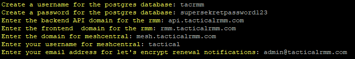
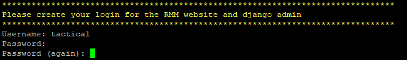
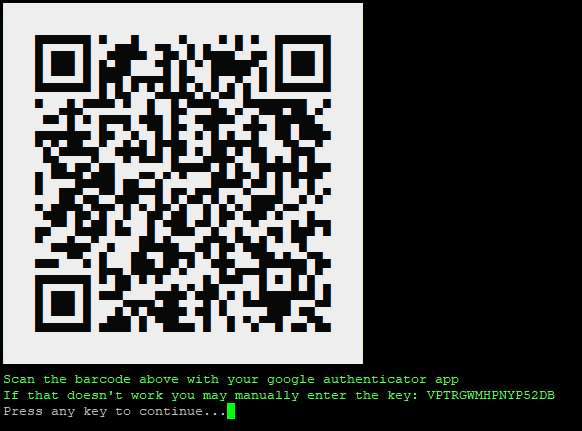
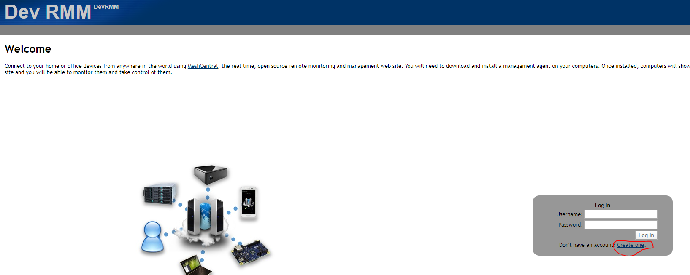
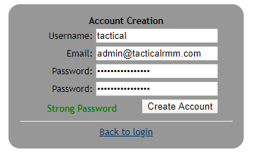
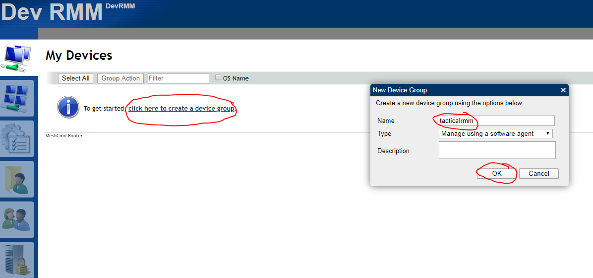
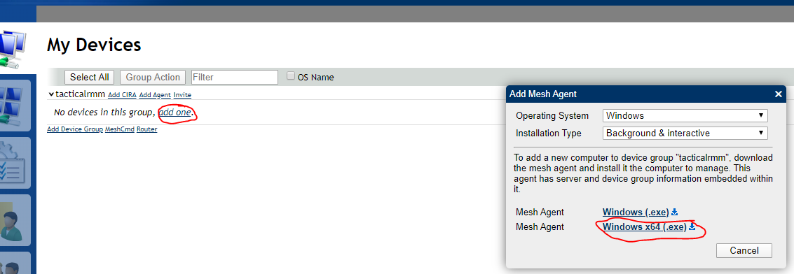
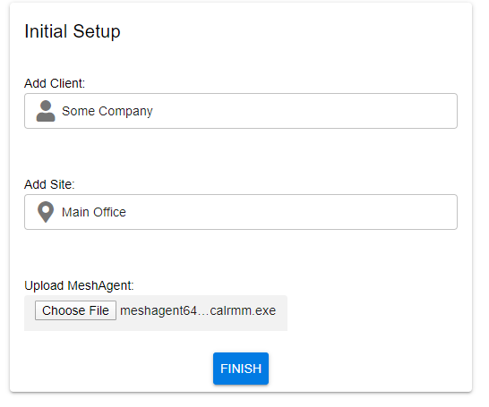
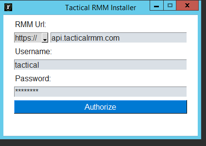
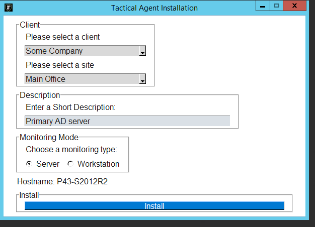

# Tactical RMM

[](https://travis-ci.com/wh1te909/tacticalrmm)
[](https://dev.azure.com/dcparsi/Tactical%20RMM/_build/latest?definitionId=4&branchName=develop)
[](https://opensource.org/licenses/MIT)
[](https://github.com/python/black)

Tactical RMM is a remote monitoring & management tool for Windows computers, built with Django and Vue.\
It uses an [agent](https://github.com/wh1te909/winagent) written in python, as well as the [SaltStack](https://github.com/saltstack/salt) api and [MeshCentral](https://github.com/Ylianst/MeshCentral)

*Tactical RMM is currently in alpha and subject to breaking changes. Use in production at your own risk.*

## Features

- Teamviewer-like remote desktop control
- Real-time remote shell
- Remote file browser (download and upload files)
- Remote command and script execution (batch, powershell and python scripts)
- Event log viewer
- Services management
- Windows patch management
- Automated checks with email/SMS alerting (cpu, disk, memory, services, scripts, event logs)
- Automated task runner (run scripts on a schedule)
- Remote software installation via chocolatey
- Software and hardware inventory

## Server Requirements

- Any modern linux distro with min 2GB ram (an install script is provided for Ubuntu Server 18.04)
- A domain you own with at least 3 subdomains
- Google Authenticator app (2 factor is NOT optional)

## Windows versions supported

- Windows 7, 8.1, 10, Server 2008R2, 2012R2, 2016, 2019

## Updating

Download and run ```update.sh```

## Installation example (Ubuntu server 18.04 LTS)

Fresh VPS with latest updates\
login as root and create a user and add to sudoers group (we will be creating a user called tactical)
```
apt update && apt -y upgrade
adduser tactical
usermod -a -G sudo tactical
```

switch to the tactical user and setup the firewall
```
su - tactical
sudo ufw default deny incoming
sudo ufw default allow outgoing
sudo ufw allow ssh
sudo ufw allow http
sudo ufw allow https
sudo ufw allow proto tcp from any to any port 4505,4506
sudo ufw enable && sudo ufw reload
```

Our domain for this example is tacticalrmm.com

In the DNS manager of wherever our domain is hosted, we will create three A records, all pointing to the public IP address of our VPS

Create A record ```api.tacticalrmm.com``` for the django rest backend\
Create A record ```rmm.tacticalrmm.com``` for the vue frontend\
Create A record ```mesh.tacticalrmm.com``` for meshcentral

Download the install script and run it

```
wget https://raw.githubusercontent.com/wh1te909/tacticalrmm/develop/install.sh
chmod +x install.sh
./install.sh
```

Enter the following values when prompted:



The install script will begin installing stuff. When it gets to this step, create the django superuser account:



Download the Google Authenticator app on your smartphone and scan the barcode that is generated:



Once the install has finished, navigate to your meshcentral site\
https://mesh.tacticalrmm.com



Create an account. Make sure to use the same username that you entered at the beginning of the install script when prompted for "meshcentral username"\
Create a strong password (does __not__ have to be the same as the django superuser account, recommend using a different password)



Now create a device group. Name it whatever you want:



Click on "add one" and download the 64bit Mesh Agent:



You will now have a file named "meshagent64-tacticalrmm.exe" in your Downloads folder

Navigate to the rmm frontend in a new tab\
https://rmm.tacticalrmm.com

Login using the username and password you created during the install script for the django superuser\
Then enter the 6 digit code from your google authenticator app when prompted

You will be redirected to the initial setup page

Create your first client and site, then upload the ```meshagent64-tacticalrmm.exe``` from your downloads folder and click Finish:



You will be taken to the homepage of the app


Now install the agent on a windows computer:

Download the latest release exe from https://github.com/wh1te909/winagent/releases

Run the installer as administrator

Make sure to use the backend api url when installing, not the frontend url\
Username and password is the same one you created for django superuser:



Choose the client and site, enter a description of the computer and then install:



Once installation finished, check the website and you will see your computer appear in the dashboard.