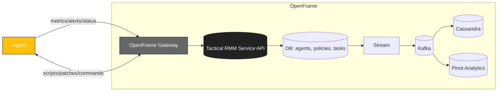

<div align="center">
  <picture>
    <!-- Dark theme -->
    <source media="(prefers-color-scheme: dark)" srcset="https://github.com/flamingo-stack/openframe-oss-tenant/blob/d82f21ba18735dac29eb0f3be5d3edf661bb0060/docs/assets/logo-openframe-full-dark-bg.png">
    <!-- Light theme -->
    <source media="(prefers-color-scheme: light)" srcset="https://github.com/flamingo-stack/openframe-oss-tenant/blob/d82f21ba18735dac29eb0f3be5d3edf661bb0060/docs/assets/logo-openframe-full-light-bg.png">
    <!-- Default / fallback -->
    
  </picture>

  <h1>Tactical RMM</h1>

  <p><b>Remote monitoring & management that integrates with OpenFrame — automated patching, monitoring, scripting, alerting, and remote control across Windows, macOS, and Linux.</b></p>

  <p>
    <a href="LICENSE.md">
      
    </a>
    <a href="https://www.flamingo.run/knowledge-base">
      
    </a>
    <a href="https://www.openmsp.ai/">
      
    </a>
  </p>
</div>

---

## Quick Links
- [Highlights](#highlights)
- [Quick Start](#quick-start)
  - [Prerequisites](#prerequisites)
  - [OpenFrame Integration](#openframe-integration)
  - [Architecture](#architecture)
- [Security](#security)
- [Contributing](#contributing)
- [License](#license)  

---

## Highlights

- Full-featured RMM: monitoring, automation, patching, remote scripts  
- Multi-tenant MSP support with client/site hierarchy  
- Automated patch management (Windows updates, software updates)  
- Alert policies and notifications (email, SMS, webhooks)  
- Remote script execution (PowerShell, Shell, Python)  
- Task scheduling and maintenance windows  
- Cross-platform agent support (Windows, macOS, Linux)  
- Asset tracking and reporting  
- Integrations: OpenFrame Gateway, Stream (Kafka), Aя

---

## Quick Start

### Prerequisites

**For OpenFrame Integration:**
- Kubernetes cluster with kubectl
- Telepresence (for local access to services)

---

### OpenFrame Integration

Tactical RMM is integrated into OpenFrame for comprehensive remote monitoring and management.

---

### Architecture

Tactical RMM runs as a service in OpenFrame and communicates with endpoint agents via Gateway. Events and metrics flow into Stream and Analytics for monitoring and reporting.


```mermaid
flowchart LR
    
    A[Agent] -- metrics/alerts/status --> G[OpenFrame Gateway]
    A <-- scripts/patches/commands --> G
    
    subgraph OpenFrame
      G --> API[(Tactical RMM Service API)]
      API --> DB[(DB: agents, policies, tasks)]
      DB --> S[Stream]
      S --> K[(Kafka)]
      K --> C[(Cassandra)]
      K --> P[(Pinot Analytics)]
    end

    style A fill:#FFC109,stroke:#1A1A1A,color:#FAFAFA
    style G fill:#666666,stroke:#1A1A1A,color:#FAFAFA
    style API fill:#212121,stroke:#1A1A1A,color:#FAFAFA
```

#### Deployment

Tactical RMM is deployed automatically as part of OpenFrame via ArgoCD app-of-apps pattern:

```yaml
# manifests/apps/values.yaml
apps:
  tacticalrmm: 
    enabled: true
    project: integrated-tools
    namespace: integrated-tools
    syncWave: "3"  # Deployed after microservices
```

**Deploy complete OpenFrame stack:**
```bash
# Install with ArgoCD
helm install openframe ./manifests/app-of-apps

# Tactical RMM will be deployed automatically along with:
# - PostgreSQL and Redis (StatefulSets)
# - Tactical RMM API, websockets, and frontend
# - Tool registration job for OpenFrame integration
```

**Access Tactical RMM UI:**
```bash
# Connect to integrated-tools namespace
telepresence connect --namespace integrated-tools

# Tactical RMM UI will be available at:
# http://tacticalrmm-frontend.integrated-tools.svc.cluster.local:8080
```

**For standalone Tactical RMM deployment** (not recommended - registration job will fail):
```bash
helm install tacticalrmm ./manifests/integrated-tools/tacticalrmm
```

#### Integration Features

**Auto-initialization:**
- Creates default organization and master account  
- Sets up initial client/site structure
- Generates API token for integration
- Persists token at `/opt/tactical/api_token.txt`
- Registers as integrated tool in OpenFrame

**Configuration** is managed via Helm chart at `manifests/integrated-tools/tacticalrmm/`.

#### Using Tactical RMM Java SDK

```java
import com.openframe.sdk.tacticalrmm.TacticalRmmClient;
import com.openframe.sdk.tacticalrmm.model.Agent;
import com.openframe.sdk.tacticalrmm.model.Script;
import com.openframe.sdk.tacticalrmm.model.Task;
import com.openframe.sdk.tacticalrmm.model.Alert;

@Service
public class RmmManagementService {
    
    private final TacticalRmmClient rmmClient;
    
    public RmmManagementService() {
        this.rmmClient = new TacticalRmmClient(
            "https://tacticalrmm-api.integrated-tools.svc.cluster.local",
            System.getenv("TACTICAL_API_TOKEN")
        );
    }
    
    // Get agent by ID
    public Agent getAgent(String agentId) throws IOException, InterruptedException {
        return rmmClient.getAgentById(agentId);
    }
    
    // List all agents
    public List<Agent> listAgents() throws IOException, InterruptedException {
        return rmmClient.listAgents();
    }
    
    // Get agents by client
    public List<Agent> getAgentsByClient(String clientId) 
            throws IOException, InterruptedException {
        return rmmClient.getAgentsByClient(clientId);
    }
    
    // Execute script on agent
    public Task executeScript(String agentId, String scriptId, Map<String, String> args) 
            throws IOException, InterruptedException {
        return rmmClient.runScript(agentId, scriptId, args);
    }
    
    // Example: Check disk space
    public Task checkDiskSpace(String agentId) 
            throws IOException, InterruptedException {
        String scriptId = "check-disk-space";
        Map<String, String> args = Map.of("threshold", "90");
        return rmmClient.runScript(agentId, scriptId, args);
    }
    
    // Install Windows updates
    public Task installWindowsUpdates(String agentId) 
            throws IOException, InterruptedException {
        return rmmClient.installWindowsUpdates(agentId);
    }
    
    // Create automated task
    public Task createTask(String agentId, Task taskConfig) 
            throws IOException, InterruptedException {
        return rmmClient.createAutomatedTask(agentId, taskConfig);
    }
    
    // Get active alerts
    public List<Alert> getActiveAlerts() 
            throws IOException, InterruptedException {
        return rmmClient.getAlerts(true);
    }
    
    // Get agent installation command
    public String getInstallCommand(String clientId, String siteId) 
            throws IOException, InterruptedException {
        return rmmClient.getAgentInstallCommand(clientId, siteId);
    }
    
    // Reboot agent
    public void rebootAgent(String agentId) 
            throws IOException, InterruptedException {
        rmmClient.rebootAgent(agentId);
    }
    
    // Get agent check results
    public List<CheckResult> getCheckResults(String agentId) 
            throws IOException, InterruptedException {
        return rmmClient.getAgentChecks(agentId);
    }
}
```

#### Troubleshooting

**Check deployment status:**
```bash
kubectl get pods -n integrated-tools -l app=tacticalrmm
kubectl logs -f tacticalrmm-api-0 -n integrated-tools
```

**Access Tactical RMM services via Telepresence:**
```bash
# Connect to cluster
telepresence connect --namespace integrated-tools

# Access Tactical RMM UI directly
open https://tacticalrmm-frontend.integrated-tools.svc.cluster.local:8080

# Access PostgreSQL for debugging
psql -h tacticalrmm-postgresql.integrated-tools.svc.cluster.local -U tactical -d tacticaldb

# Access Redis for debugging
redis-cli -h tacticalrmm-redis.integrated-tools.svc.cluster.local
```

For complete documentation:
- [Tactical RMM Official Docs](https://docs.tacticalrmm.com/)
- [OpenFrame Java SDK](https://github.com/flamingo-stack/openframe-oss-lib/tree/main/sdk/tacticalrmm)

---

## Security

- TLS 1.2 enforced for all API communication
- JWT authentication with OpenFrame Gateway
- Multi-tenant access controls
- Agents authenticate with enrollment keys
- Least-privilege role model

Found a vulnerability? Email security@flamingo.run instead of opening a public issue.

---

## Contributing

We welcome PRs! Please follow these guidelines:  
- Use branching strategy: `feature/...`, `bugfix/...`  
- Add descriptions to the **CHANGELOG**  
- Follow consistent Go code style (`go fmt`, linters)  
- Keep documentation updated in `docs/`  

---

## License

This project is licensed under the **Flamingo Unified License v1.0** ([LICENSE.md](LICENSE.md)).

---

<div align="center">
  <table border="0" cellspacing="0" cellpadding="0">
    <tr>
      <td align="center">
        Built with 💛 by the <a href="https://www.flamingo.run/about"><b>Flamingo</b></a> team
      </td>
      <td align="center">
        <a href="https://www.flamingo.run">Website</a> • 
        <a href="https://www.flamingo.run/knowledge-base">Knowledge Base</a> • 
        <a href="https://www.linkedin.com/showcase/openframemsp/about/">LinkedIn</a> • 
        <a href="https://www.openmsp.ai/">Community</a>
      </td>
    </tr>
  </table>
</div>
