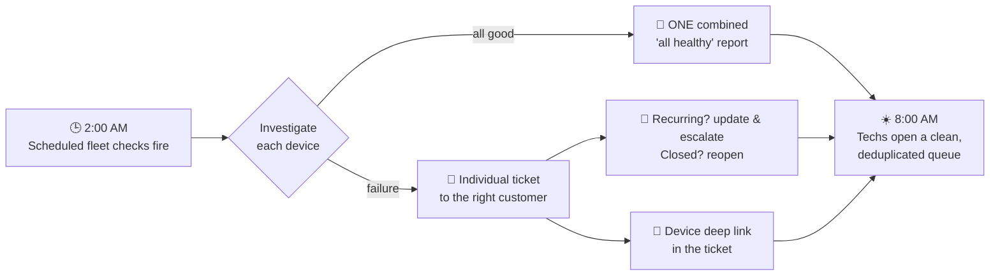

<!--
  Community-facing overview of the AI Assistant / AI Ticketing feature set.
  Intentionally vendor-neutral: no company, customer, or deployment specifics.
  Drop screen recordings into docs/media/ and they will animate inline on GitHub.
-->

# 🤖 Pi AI for Tactical RMM — your RMM just grew a night shift

> **What if your RMM didn't just *tell* you something broke — but investigated it, fixed what it safely could, opened a properly-attributed ticket in your helpdesk, updated the customer, and handed your techs a clean, deduplicated queue every morning?**

That's this. It turns Tactical RMM from a monitoring dashboard into an **autonomous, self-documenting AI teammate** that works across your entire fleet — 24/7, unattended, and under your control.

---

## 🎬 See it in action

<!-- Record 10–20s screen captures and drop them here; GitHub auto-plays .gif -->
| | |
|---|---|
| **Right-click a device → talk to it** |  |
| **Scheduled fleet checks that only ticket real problems** |  |
| **Auto-drafted helpdesk integration (two boxes, one AI)** |  |
| **Client/Site "AI History" review across every machine** |  |

*(No GIFs yet? The written walkthroughs below stand on their own.)*

---

## 🧠 The problem every MSP/IT team lives with

- Alerts fire at 2AM. A human still has to log in, diagnose, decide, and write it up.
- The same issue generates **five duplicate tickets** by morning.
- Tickets land on the **wrong contact** (or a `noreply@` address), so nobody can route them.
- "All good" checks generate noise; real failures get buried.
- Every helpdesk/PSA has a different API, so "just integrate it" is a project.

**Monitoring finds problems. This closes the loop from _detection → diagnosis → ticket → customer comms → clean queue_.**

---

## ⚡ What it actually does

### 1. An AI that *operates* devices — not just chats
Right-click any device → **Pi.dev** → a chat scoped **only** to that machine. It has real, gated shell access through the agent:
- Reads logs, checks services, inspects disks/processes, runs diagnostics.
- Proposes fixes and — with **approve/deny** on every action — runs them.
- Read-only mode, per-role write permissions, and a global **kill switch** for spend.

### 2. Unattended fleet checks that respect your attention
Schedule an AI task ("check this UniFi controller nightly") or fan one prompt across **hundreds of machines** ("verify every backup ran"). Each run investigates and returns a verdict — **and only bothers a human when something is actually wrong.**

Real-world checks teams run today:
- 🖧 **Network/UniFi health** — orphaned devices, bad uplinks, WAN outages.
- 💾 **Backup verification** — every job on every server actually succeeded and is recent.
- 🗄️ **Storage/ZFS health** — degraded pools, failing disks, capacity.

### 3. Tickets done *right*, automatically
When a check finds something actionable, it opens a ticket in **your** helpdesk with the stuff humans always get wrong:
- ✅ **Correct customer** — resolved by closest-match, with a safe internal fallback that flags "unmatched" instead of guessing.
- ✅ **No duplicates** — a recurring issue **updates and escalates** the existing ticket ("still failing after N checks — needs action now") instead of spawning new ones.
- ✅ **Auto-reopen** — if a closed ticket's problem comes back, it reopens with an explanation.
- ✅ **One combined report** for everything that's healthy (a single "all-green" summary), and **individual tickets** only for real failures.
- ✅ **A deep link to the device** right in the ticket — a logged-in tech clicks straight to it.
- ✅ **Customer-safe replies** — the AI writes as a tech, and is hard-blocked from promising schedules, dispatch times, or inventing facts.

### 4. Works with *any* helpdesk — defined in settings, not code
Two boxes in Global Settings:
- 📝 **Policy** (plain English): *when* to open/reply/note, and *which* operations to call.
- 🧩 **Integration code** (`helpdesk.js`): the *precise* API logic for your system.

Swap from one PSA/helpdesk to another by editing text — **no redeploy, no fork, no code shipped for your specific vendor.** The API key stays server-side and is never exposed to the model.

### 5. 🪄 "Use AI to Help Create These"
Don't want to write that integration? Click one button. The AI **interviews you** about your helpdesk (product, API style, auth, how you create/search/reply to tickets), then **drafts both boxes for you** to review and apply. Setup goes from "developer project" to "five-minute conversation."

### 6. Client/Site "AI History" — a manager's dream review
Right-click a **client or site** → **AI History** → one screen of **everything** the AI did across **every machine** under it: chats, scheduled runs, bulk runs — each tagged with the device, who triggered it, and the outcome. Perfect for QBRs and shift handoffs.

---

## 🌙 A night in the life

Your humans wake up to a **triaged, attributed, no-duplicate queue** — and a single green report proving the rest of the fleet was checked.

---

## 🔒 Built for control (because it has real power)

- **Approve/deny** on every device-changing action; read-only sessions by default for "resolve" flows.
- **Per-role permissions** — who can use AI, which **models** they may pick, who can let it make changes.
- **Model-agnostic** — bring your own provider/key (Anthropic, OpenAI, Google, xAI, OpenRouter, or self-hosted/OpenAI-compatible). Mark a default, expose a curated catalog.
- **Cost guardrails** — session limits, a fleet-wide **emergency stop**, and unattended runs that stay read-only unless you allow otherwise.
- **Least privilege** — the helpdesk service account and API keys live server-side; the model never sees them, and its outputs are scrubbed.

---

## 🏆 Why this is *the* feature for an RMM

An RMM exists to **reduce toil and shrink MTTR**. Everything else is plumbing to that end. This feature attacks it directly:

- **Detection → resolution, not detection → another alert.** The loop actually closes.
- **Your queue becomes signal.** One green report + real tickets only, correctly attributed, no dupes.
- **Institutional knowledge, encoded.** Your triage runbooks become prompts any tech (or the AI) runs consistently at 3AM.
- **Vendor-neutral by design.** It bends to *your* helpdesk, not the other way around.
- **It scales the thing you can't hire fast enough:** senior triage judgment, applied to the whole fleet, every night.

**Monitoring watches. This works.**

---

## 🚀 Getting started

1. Add an AI provider + model in **Global Settings → Pi.dev AI** and mark a default.
2. Grant roles the AI permissions they need.
3. Click **"Use AI to Help Create These"** and let it draft your helpdesk integration.
4. Right-click a device → **Pi.dev**, or schedule your first fleet check.
5. Watch your morning queue get quieter.

---

*Built as an extension to [Tactical RMM](https://github.com/amidaware/tacticalrmm). Bring your own AI provider and helpdesk — everything else is configuration.*
