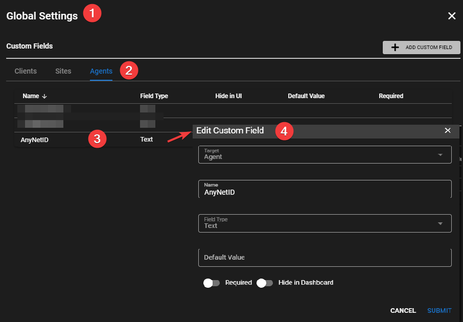
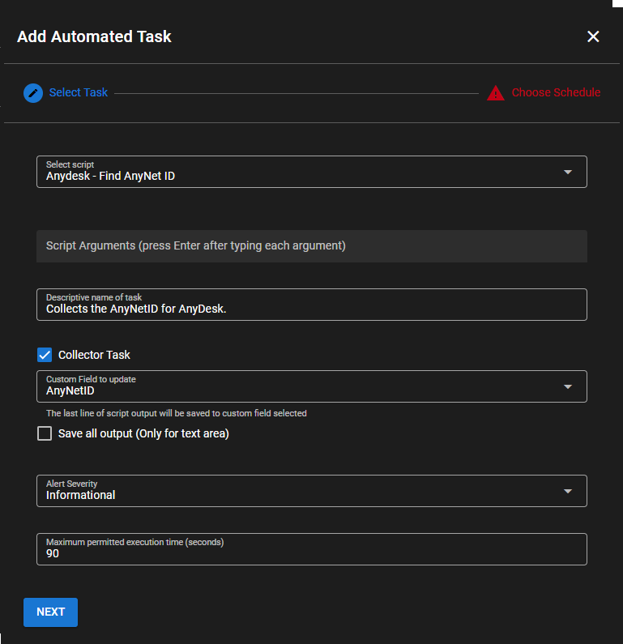

# AnyDesk

## AnyDesk Integration

!!!info
     You can setup a full automation policy to collect the machine GUID but this example will collect from just one agent for testing purposes.

From the UI go to **Settings > Global Settings > CUSTOM FIELDS > Agents**

Add Custom Field</br>
**Target** = `Agent`</br>
**Name** = `AnyNetID`</br>
**Field Type** = `Text`</br>



While in Global Settings go to **URL ACTIONS**

Add a URL Action</br>
**Name** = `AnyDesk Control`</br>
**Description** = `Connect to a AnyDesk Session`</br>
**URL Pattern** =

```html
anydesk:{{agent.AnyNetID}}
```

Navigate to an agent with AnyDesk running (or apply using **Settings > Automation Manager**).</br>
Go to Tasks.</br>
Add Task</br>
**Select Script** = `AnyDesk - Get AnyNetID for client` (this is a builtin script from script library)</br>
**Descriptive name of task** = `Collects the AnyNetID for AnyDesk.`</br>
**Collector Task** = `CHECKED`</br>
**Custom Field to update** = `AnyNetID`</br>



Click **Next**</br>
Check **Manual**</br>
Click **Add Task**

Right click on the newly created task and click **Run Task Now**.

Give it a second to execute then right click the agent that you are working with and go to **Run URL Action > AnyDesk Control**

It launch the session in AnyDesk.
