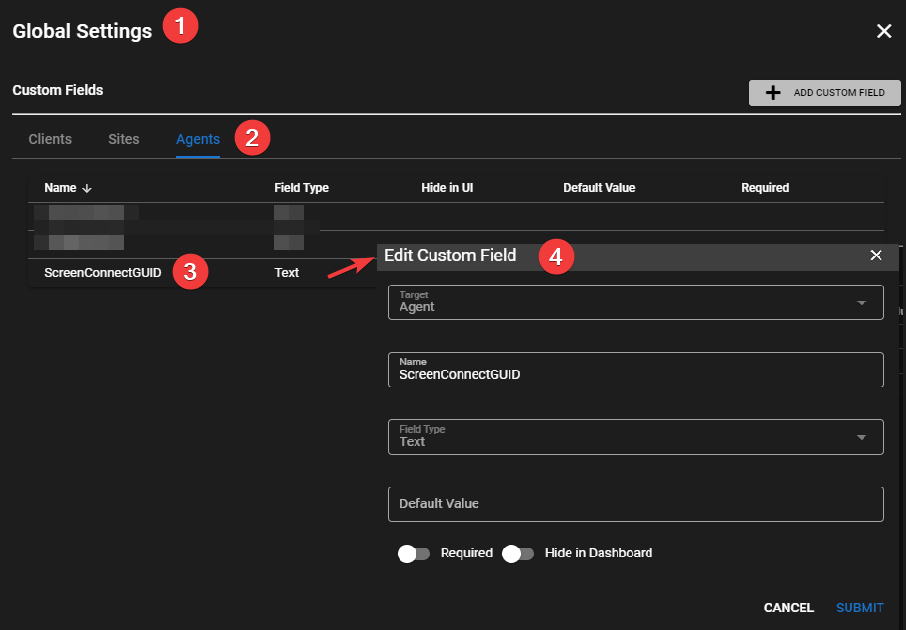
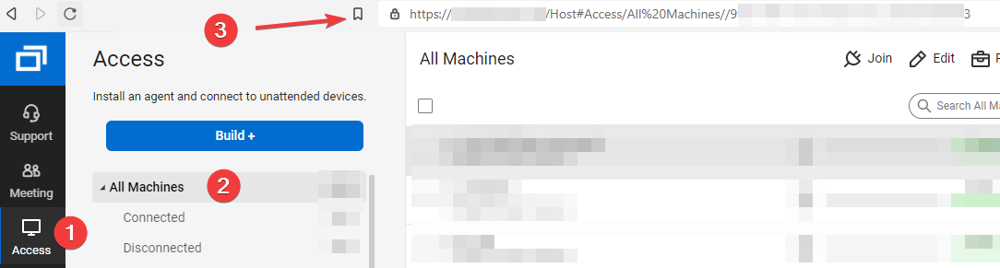
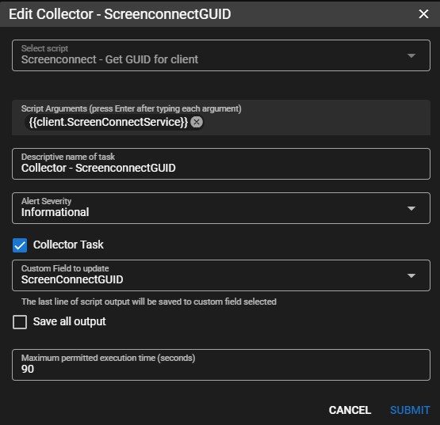

# Screenconnect / Connectwise Control

## Connectwise Control Integration

!!!info
     To make this work you will need the name of a the Service from one of your agents running a Screen Connect Guest.

!!!info
     You can setup a full automation policy to collect the machine GUID but this example will collect from just one agent for testing purposes.

From the UI go to **Settings > Global Settings > CUSTOM FIELDS > Agents**

Add Custom Field</br>
**Target** = `Client`</br>
**Name** = `ScreenConnectService`</br>
**Field Type** = `Text` </br>
**Default Value** = `The name of your SC Service eg. ScreenConnect Client (XXXXXXXXXXXXXXXXX)`</br>


Add Custom Field</br>
**Target** = `Agent`</br>
**Name** = `ScreenConnectGUID`</br>
**Field Type** = `Text`</br>



While in Global Settings go to **URL ACTIONS**

Add a URL Action</br>
**Name** = `ScreenConnect`</br>
**Description** = `Launch Screen Connect Session`</br>
**URL Pattern** =

```html
https://<your_screenconnect_fqdn_with_port>/Host#Access/All%20Machines//{{agent.ScreenConnectGUID}}/Join
```



Navigate to an agent with ConnectWise Service running (or apply using **Settings > Automation Manager**).</br>
Go to Tasks.</br>
Add Task</br>
**Select Script** = `ScreenConnect - Get GUID for client` (this is a builtin script from script library)</br>
**Script argument** = `-serviceName{{client.ScreenConnectService}}`</br>
**Descriptive name of task** = `Collects the Machine GUID for ScreenConnect.`</br>
**Collector Task** = `CHECKED`</br>
**Custom Field to update** = `ScreenConectGUID`</br>



Click **Next**</br>
Check **Manual**</br>
Click **Add Task**

Right click on the newly created task and click **Run Task Now**.

Give it a second to execute then right click the agent that you are working with and go to **Run URL Action > ScreenConnect**

It should ask you to sign into your Connectwise Control server if you are not already logged in and launch the session.

*****

## Install Tactical RMM via Screeconnect commands window

1. Create a Deplopment under **Agents > Manage Deployments**
2. Replace `<deployment URL>` below with your Deployment Download Link.

**x64**

```cmd
#!ps
#maxlength=500000
#timeout=600000

Invoke-WebRequest "<deployment URL>" -OutFile ( New-Item -Path "C:\temp\trmminstallx64.exe" -Force )
$proc = Start-Process c:\temp\trmminstallx64.exe -ArgumentList '-silent' -PassThru
Wait-Process -InputObject $proc

if ($proc.ExitCode -ne 0) {
    Write-Warning "$_ exited with status code $($proc.ExitCode)"
}
Remove-Item -Path "c:\temp\trmminstallx64.exe" -Force 
```

**x86**

```cmd
#!ps
#maxlength=500000
#timeout=600000

Invoke-WebRequest "<deployment URL>" -OutFile ( New-Item -Path "C:\temp\trmminstallx86.exe" -Force )
$proc = Start-Process c:\temp\trmminstallx86.exe -ArgumentList '-silent' -PassThru
Wait-Process -InputObject $proc

if ($proc.ExitCode -ne 0) {
    Write-Warning "$_ exited with status code $($proc.ExitCode)"
}
Remove-Item -Path "c:\temp\trmminstallx86.exe" -Force 
```

*****
