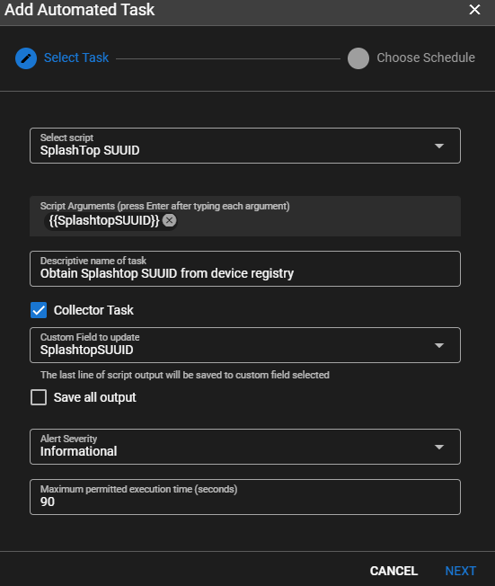

# Splashtop

## Splashtop Integration


From the UI go to **Settings > Global Settings > CUSTOM FIELDS > Agents**

Add Custom Field</br>
**Target** = `Agent`</br>
**Name** = `SplashtopSUUID`</br>
**Field Type** = `Text`</br>


While in Global Settings go to **URL ACTIONS**

Add a URL Action</br>
**Name** = `Splashtop`</br>
**Description** = `Connect to a Splashtop client`</br>
**URL Pattern** =

```html
st-business://com.splashtop.business?account=&uuid={{agent.SplashtopSUUID}}&sessiontype=remote
```

Navigate to an agent with Splashtop running (or apply using **Settings > Automation Manager**).</br>
Go to Tasks.</br>
Add Task</br>
**Select Script** = `Splashtop - Get SUUID for client` (this is a builtin script from script library)</br>
**Descriptive name of task** = `Obtain Splashtop SUUID from device registry.`</br>
**Collector Task** = `CHECKED`</br>
**Custom Field to update** = `SplashtopSUUID`</br>



Click **Next**</br>
Check **Manual**</br>
Click **Add Task**

Right click on the newly created task and click **Run Task Now**.

Give it a second to execute then right click the agent that you are working with and go to **Run URL Action > Splashtop**