## Bitdefender Gravityzone

Admin URL: <https://cloud.gravityzone.bitdefender.com/>

To exclude URLs: Policies > {policy name} > Network Protection > Content Control > Settings > Exclusions

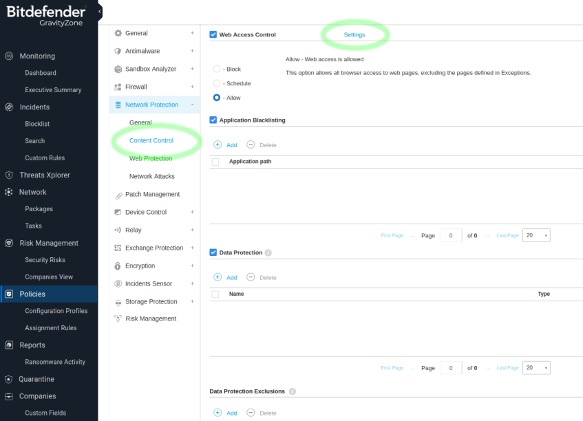

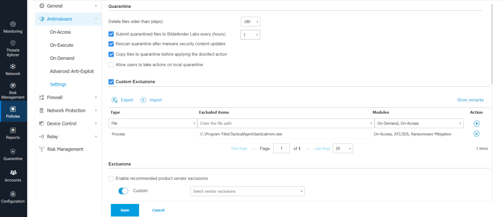

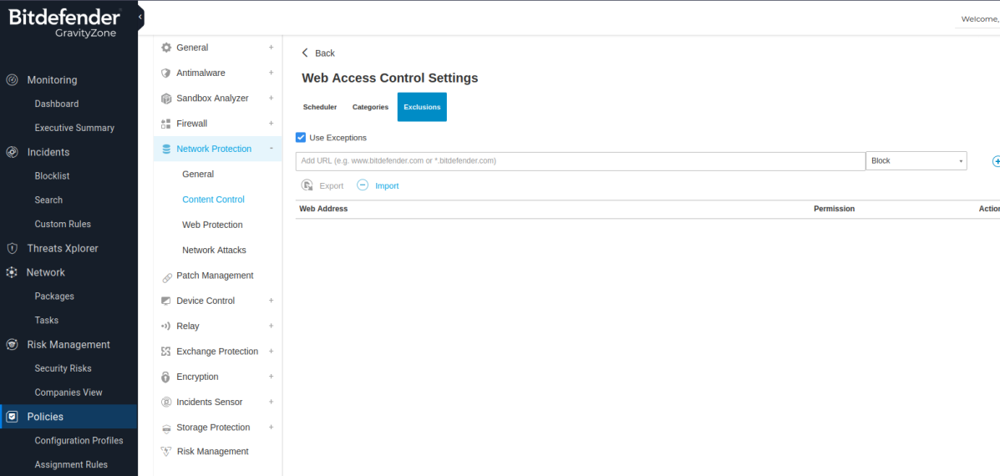

## Webroot

Admin URL:

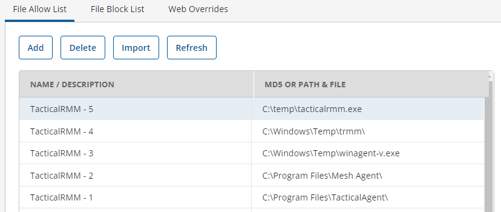

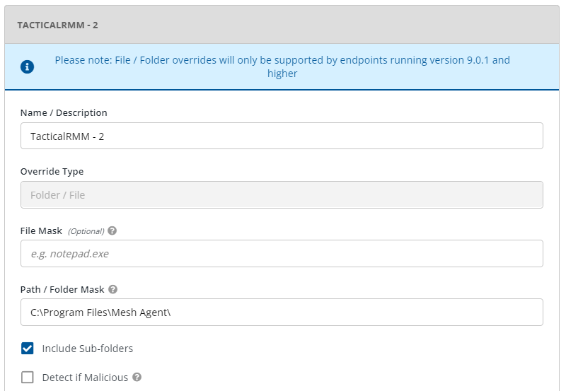

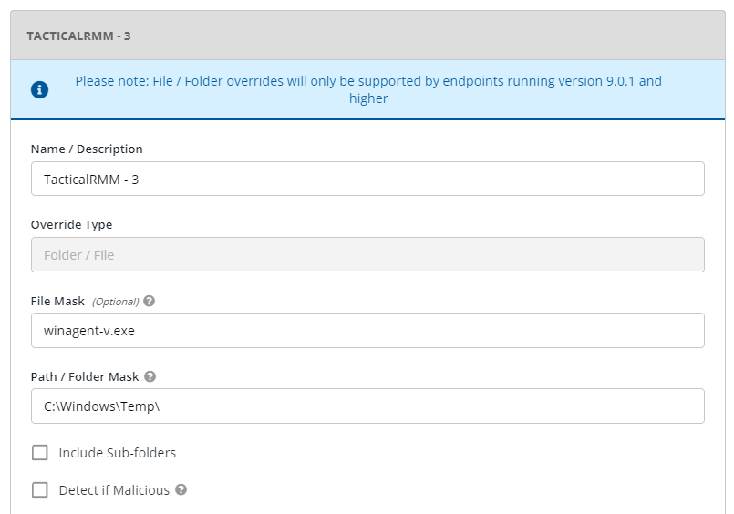

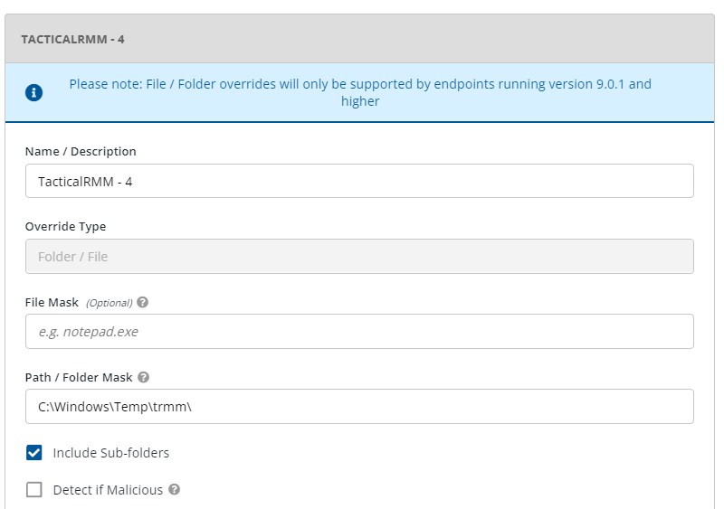

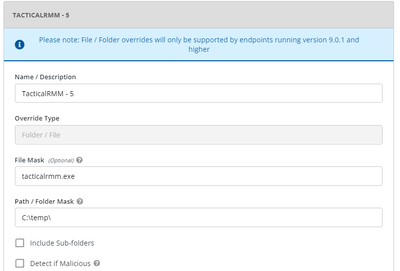

## Sophos

### Sophos Central Admin

Go To Global Settings >> General >> Global Exclusions >> Add Exclusion

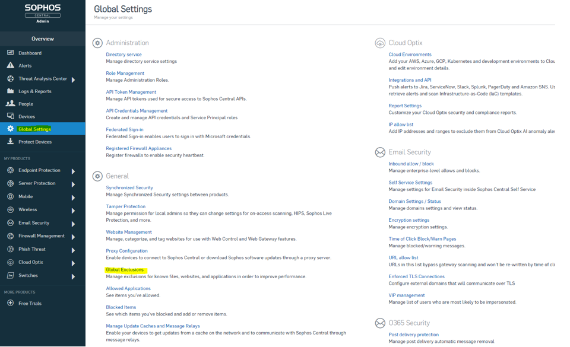

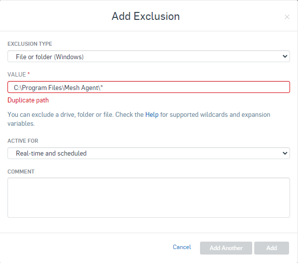

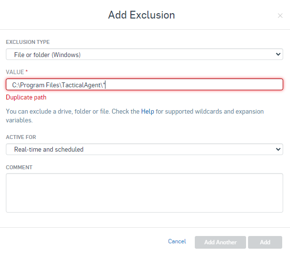

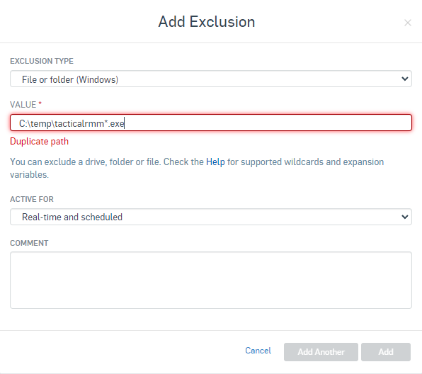

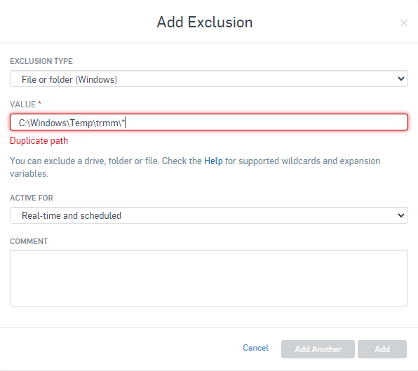

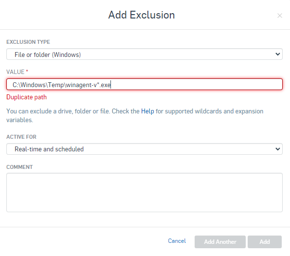

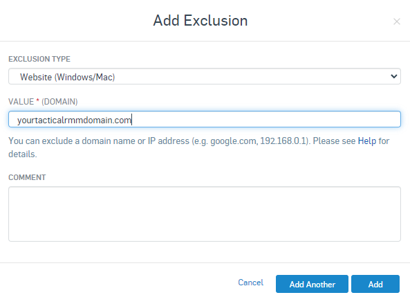

### Sophos XG Firewall

Log into Sophos Central Admin

Admin URL: <https://cloud.sophos.com/>

Log into the Sophos XG Firewall

Go To System >> Hosts and services >> FQDN Host Group and create a new group

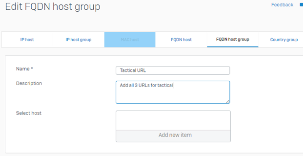

Go To System >> Hosts and services >> FQDN Host

Create the following 3 hosts and add each to your FQDN host group.

- api.yourdomain.com
- mesh.yourdomain.com
- rmm.yourdomain.com (Optional if you want your client to have GUI access to Tactical RMM)

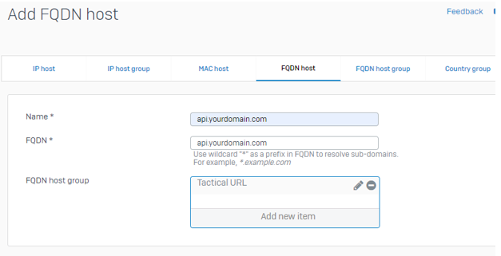

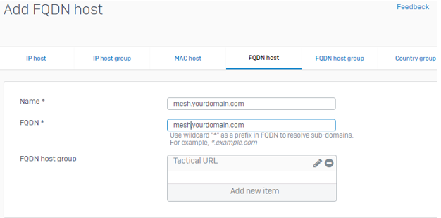

Go To Hosts and services >> Services and create the following services

- Name: Tactical-Service-4222
    - Protocol: TCP
    - Source port: 1:65535
    - Destination port: 4222
- Name: Tactical-Service-443
    - Protocol: TCP
    - Source port: 1:65535
    - Destination port: 443

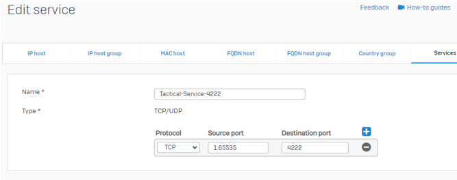

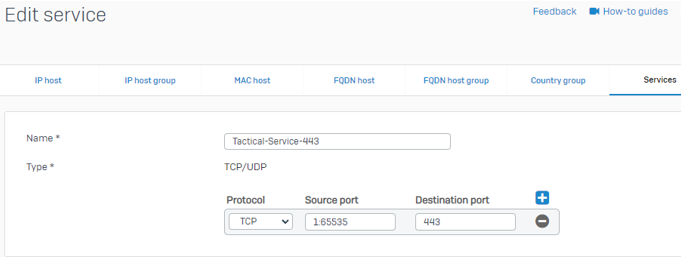

Go To Hosts and services >> Service group and create the following service group

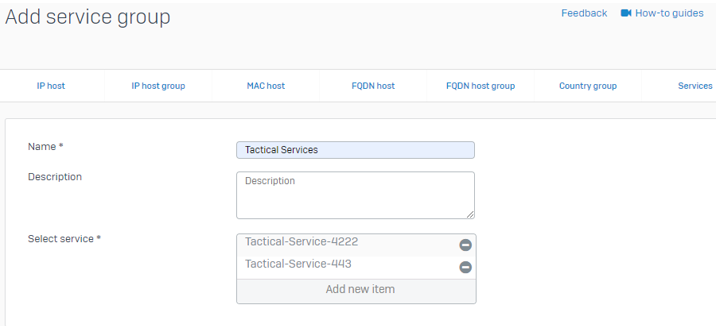

Go To Protect >> Rules and policies and add a firewall rule

- Rule name: Tactical Rule
- Rule position: Top
- Source zones: LAN
- Source networks: ANY
- Destination zones: WAN
- Destination networks: Your FQDN Host Group
- Services: Tactical Services

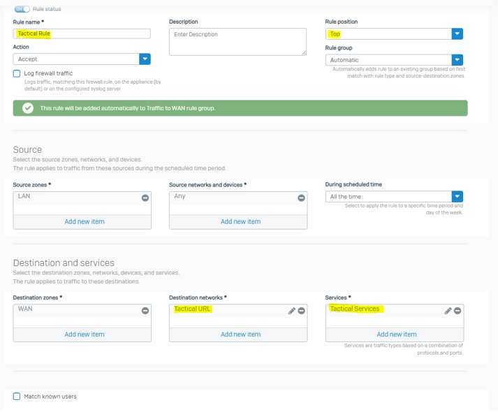

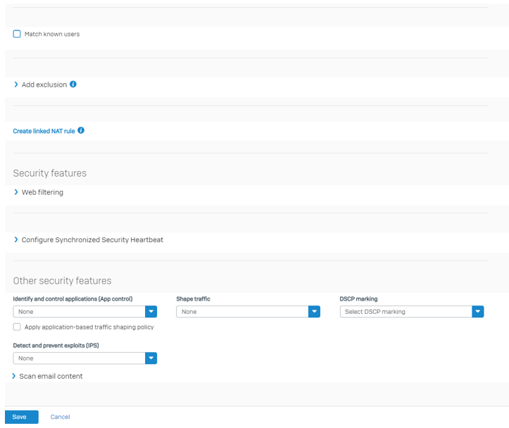

Optionally select Log Firewall Traffic checkbox for troubleshooting.
