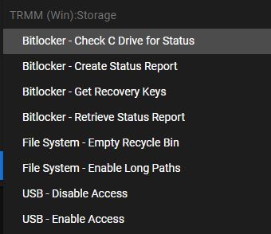

## Script Library Naming Conventions

### File names 

Under `/scripts` the file name should generally follow this format:

```
(Platform)_(Category or Function)_(What It Does).xxx
```

!!!info
    Although Tactical RMM only has a Windows agent for now, we're planning for a future with more platform support

Platform for now are:

```
Win
OSX
Linux
iOS
Android
```


Good filename examples include:

```
Win_Azure_Mars_Cloud_Backup_Status.ps1
Win_AzureAD_Check_Connection_Status.ps1
Win_Network_DHCP_Set.bat
Win_Network_DNS_Set_to_1.1.1.2.ps1
```

!!!info
    This is so that at a glance you can see if there is already a script with that function, and you can avoid duplication of functionality. If you can improve a script or allow Script Arguments/Parameters update existing if possible

### Name field (in community_scripts.json)

Consider they are viewed in 3 different locations:

Script Manager

- List View (sortable by any column)

- Folder View (Grouped by Categories)

Run or Add script 

- Running scripts manually or adding tasks (or adding in Automation Manager)

!!!info
    A good max length is 50-60 chars or less for display in these 3 locations

Make sure your Name roughly follows the order of file naming as above

```
Category or Function - What It Does
```

 Consider how the alphabetic sort will affect display



*****

## Making Script Files

### Good Habits

- Try and make them fully self-contained. 

- If they pull data from elsewhere, create comment notes at the top with references for others to audit/validate

- Good folder locations to use for standardized things:
```
c:\ProgramData\TacticalRMM\
c:\ProgramData\TacticalRMM\scripts
c:\ProgramData\TacticalRMM\toolbox
c:\ProgramData\TacticalRMM\logs
c:\ProgramData\TacticalRMM\temp
c:\ProgramData\TacticalRMM\
```

- Command Parameters are good. Optional command parameters for extra functions are better. 

- Add standardized Comment headers to scripts (include the first 2, more if appropriate):
```powershell
<#
.Synopsis
   Short description
   eg Check IP address
.DESCRIPTION
   Long description
   eg Checks IP address on all local network adapters, and returns results
.EXAMPLE
   Example of how to use this cmdlet
.EXAMPLE
   Another example of how to use this cmdlet
.INPUTS
   Inputs to this cmdlet (if any)
.OUTPUTS
   Output from this cmdlet (if any)
.NOTES
   General notes
   eg v1.0
.COMPONENT
   The component this cmdlet belongs to
.ROLE
   The role this cmdlet belongs to
.FUNCTIONALITY
   The functionality that best describes this cmdlet
#>
```

### Bad Habits

- Assumes non-standard configurations

- Doesn't play well with other community scripts (reused names etc.)


*****

## Useful Reference Script Examples

RunAsUser (since Tactical RMM runs as system)
[https://github.com/wh1te909/tacticalrmm/blob/develop/scripts/Win_Display_Message_To_User.ps1](https://github.com/wh1te909/tacticalrmm/blob/develop/scripts/Win_Display_Message_To_User.ps1)

Command Paramater Ninja
[https://github.com/wh1te909/tacticalrmm/blob/develop/scripts/Win_ScreenConnectAIO.ps1](https://github.com/wh1te909/tacticalrmm/blob/develop/scripts/Win_ScreenConnectAIO.ps1)

Optional Command Parameters and testing for errors
[https://github.com/wh1te909/tacticalrmm/blob/develop/scripts/Win_Rename_Computer.ps1](https://github.com/wh1te909/tacticalrmm/blob/develop/scripts/Win_Rename_Computer.ps1)

*****

## Volunteers Needed

If you want to contribute back to the project there are a lot of scripts that need some TLC (Tender Loving Care) please paruse thru them here: [https://github.com/wh1te909/tacticalrmm/tree/develop/scripts_wip](https://github.com/wh1te909/tacticalrmm/tree/develop/scripts_wip)

Discuss/ask questions in the Discord group [here](https://discord.com/channels/736478043522072608/744281869499105290)

What you can add is:

   - Add standardized Comment headers per above
   - Parameterize scripts where appropriate
   - Add $ExitCode and error conditions as appropriate
   - Contact @silversword in Discord if you need help doing Github additions/edits/adding to the community Library and have questions about [Script Library Naming Conventions](#script-library-naming-conventions)

