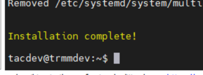

Hidden docs, needs work

For local Hyper-v Devbox notes

From https://raw.githubusercontent.com/silversword411/tacticalrmm-devdocs

Needs an official install_devbox.sh script

# Setup local devbox in hyper-v VM


## Install Ubuntu 20.04 LTS
Don't forget to 

```bash
sudo apt-get updates && sudo apt-get upgrade
```

### Optional
Set all users in sudo group not to require password every time:

```bash
sudo visudo
```

Add this:

```
%sudo ALL=(ALL) NOPASSWD: ALL
```

## Download customized install script and tweak

Create folder to dump into

```bash
sudo mkdir /rmm
sudo chown ${USER}:${USER} -R /rmm
cd /rmm
```

Get dev install script
```bash
wget https://raw.githubusercontent.com/silversword411/tacticalrmm-devdocs/blob/main/install_devbox.sh
```

Edit, and search for `REPLACEMEWITHYOURFORKEDREPOURL`

and replace with your forked repo URL (example commented out below)

## Run it

```bash
./install_devbox.sh
```
## Watch for



!!!Note Unlike regular installs, don't worry about the QR code

## Celebrate


# Misc commands

### Start mkdocs on dev box

```bash
cd /rmm/api
source env/bin/activate
pip install --upgrade pip
pip install --upgrade setuptools wheel
pip install -r tacticalrmm/requirements-dev.txt
cd /rmm/docs
mkdocs serve
```

### Running tests locally

Prep and update

```bash
source /rmm/api/env/bin/activate
cd /rmm/api/tacticalrmm
pip install -r requirements.txt
```

Then run tests

```bash
python manage.py test
```

## Misc Notes

### Spinning up front end web interface in development


```bash
cd /web
npm run serve
```