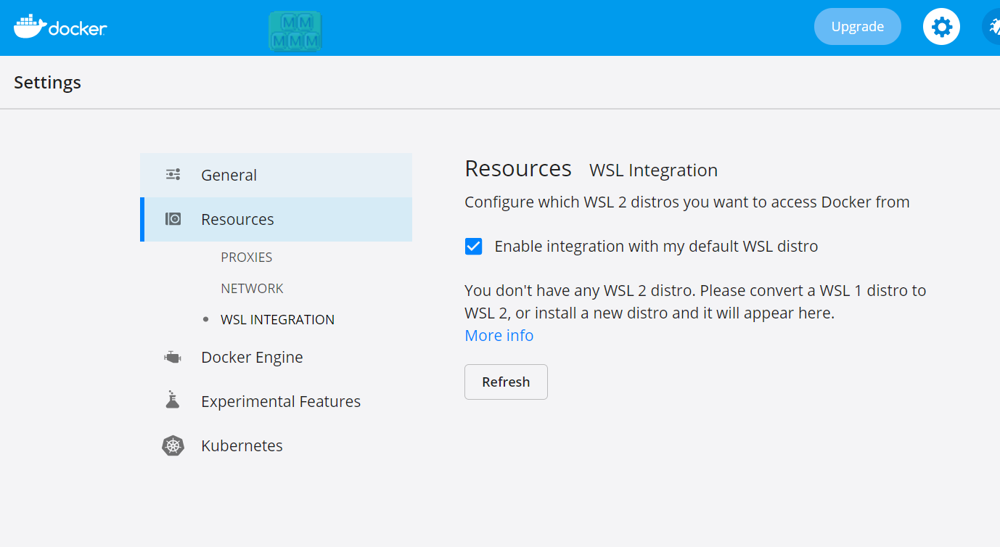
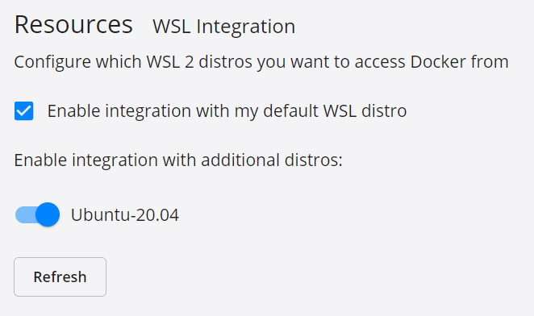
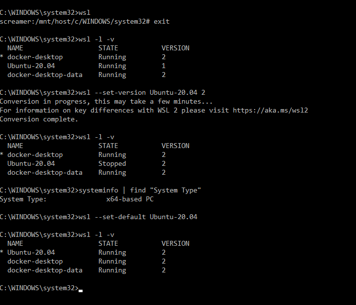
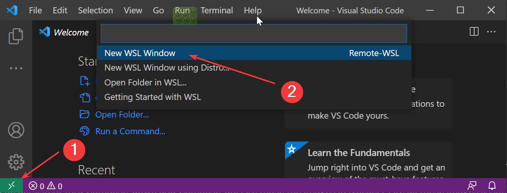
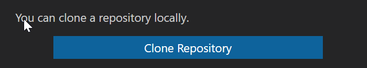

## Install WSL2

https://docs.microsoft.com/en-us/windows/wsl/install-win10


## Install Docker Desktop

https://www.docker.com/products/docker-desktop

### Configure Docker

Make sure it doesn't look like this


This is better



### Check and make sure WSL is v2 and set Ubuntu as default

[https://docs.microsoft.com/en-us/windows/wsl/install-win10#set-your-distribution-version-to-wsl-1-or-wsl-2](https://docs.microsoft.com/en-us/windows/wsl/install-win10#set-your-distribution-version-to-wsl-1-or-wsl-2)



## Install VSCode Extensions

[Remote - Containers](https://marketplace.visualstudio.com/items?itemName=ms-vscode-remote.remote-containers)

[Docker](https://marketplace.visualstudio.com/items?itemName=ms-azuretools.vscode-docker)

## Connect to WSL and clone your Github fork





## Create .env file

Under .devcontainer duplicate

```
.env.example
```

as 

```
.env
```

Customize to your tastes (it doesn't need to be internet configured, just add records in your `hosts` file) eg

```
127.0.0.1    rmm.example.com
127.0.0.1    api.example.com
127.0.0.1    mesh.example.com
```

## Launch your Dev VM in Docker

Right-click `docker-compose.yml` and choose `Compose Up`

Wait, it'll take a while as docker downloads all the modules and gets running.

## Develop!

You're operational!

!!!note
    Self-signed certs are in your dev environment. Navigate to https://api.example.com and https://rmm.example.com and accept the self signed certs to get rid of errors.

### View mkdocks live edits in browser

Change stuff in `/docs/docs/`

mkdocs is Exposed on Port: 8005

Open: [http://rmm.example.com:8005/](http://rmm.example.com:8005/)

### View django administration

Open: [http://rmm.example.com:8000/admin/](http://rmm.example.com:8000/admin/)

