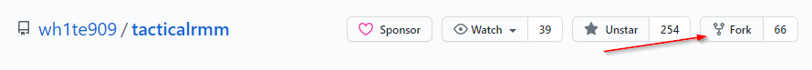
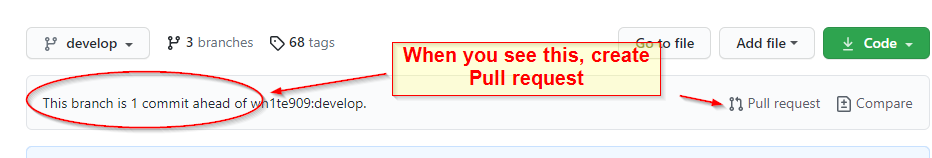
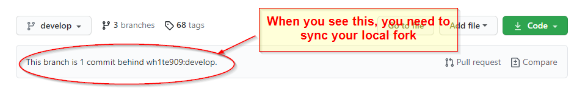
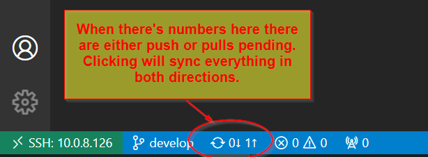

## Getting Started

### 1. Install vscode
[https://code.visualstudio.com/download](https://code.visualstudio.com/download)

### 2. Fork Project in Github

This is making a duplicate of the code under your Github that you can edit

[https://github.com/wh1te909/tacticalrmm](https://github.com/wh1te909/tacticalrmm)



### 3. Add your (forked) repo to vscode

Clone repository

Login to your Github

Choose local folder

#### 3a. Install extra vscode Extensions

GitLens

Remote - SSH

### 4. Open Terminal

[https://code.visualstudio.com/docs/editor/integrated-terminal](https://code.visualstudio.com/docs/editor/integrated-terminal)

```
Ctrl+`
```

### 5. Configure a remote for your fork (in vscode)

[https://docs.github.com/en/github/collaborating-with-issues-and-pull-requests/configuring-a-remote-for-a-fork](https://docs.github.com/en/github/collaborating-with-issues-and-pull-requests/configuring-a-remote-for-a-fork)

Configure your local fork and tell it where the original code repo is so you can compare and merge updates later when official repo is updated

Check repos

```
git remote -v
```

Add upstream repo

```
git remote add upstream https://github.com/wh1te909/tacticalrmm
```

Confirm changes

```
git remote -v
```


### 6. Contribute code

Make changes to something.

`Commit` (update something) and notate what you did

`Push` (from your local vscode to your github fork)

Open browser and look at your repo (It should reflect your commit)


#### 6a. Request your changes to be pulled into the primary repo (Pull Request)



In browser create pull request

### 7. Sync your local fork

[https://docs.github.com/en/github/collaborating-with-issues-and-pull-requests/syncing-a-fork](https://docs.github.com/en/github/collaborating-with-issues-and-pull-requests/syncing-a-fork)

Bring changes from original repo to your local vscode copy so you're current with changes made in original Github repo



In VSCode open TERMINAL

```
Ctrl+`
```

Tell git to pull from the GitHub upstream repo all new changes into your local directory

```
git pull --rebase upstream develop
```
#### 7a. Push your local updated copy to your Github fork

Then you're `push`ing that updated local repo to your online Github fork



### 8. Verify and Repeat

Check your Github fork in browser, should be up to date now with original. Repeat 6 or 7 as necessary

*****
## Reference

### Customizing the Admin Web Interface

Created using quasar, it's all your .vue files in `web/src/components/modals/agents/RunScript.vue`

Learn stuff here

https://quasar.dev/


