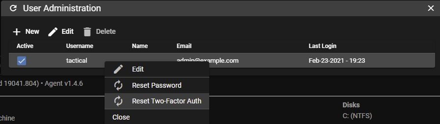

# FAQ


#### How do I do X feature in the web UI?
Alot of features in the web UI are hidden behind right-click menus; almost everything has a right click menu so if you don't see something, try right clicking on it.
#### Where are the Linux / Mac agents?
Linux / Mac agents are currently under development.

#### Can I run Tactical RMM locally behind NAT without exposing anything to the internet?
Yes, you will just need to setup local DNS for the 3 subdomains, either by editing host files on all your agents or through a local DNS server.
#### I am locked out of the web UI. How do I reset my password?

SSH into your server and run:
```bash
/rmm/api/env/bin/python /rmm/api/tacticalrmm/manage.py reset_password <username>
```

<br/>

#### How do I reset password or 2 factor token?
From the web UI, click **Settings > User Administration** and then right-click on a user:<br/><br/>

<br/><br/>
Or from the command line:<br/>
```bash
/rmm/api/env/bin/python /rmm/api/tacticalrmm/manage.py reset_2fa <username>
```
Then simply log out of the web UI and next time the user logs in they will be redirected to the 2FA setup page which will present a barcode to be scanned with the Authenticator app.

<br/>

#### How do I recover my MeshCentral login credentials?

From Tactical's web UI: *Settings > Global Settings > MeshCentral*

Copy the username then ssh into the server and run:

```bash
cd /meshcentral/
sudo systemctl stop meshcentral
node node_modules/meshcentral --resetaccount <username> --pass <newpassword>
sudo systemctl start meshcentral
```