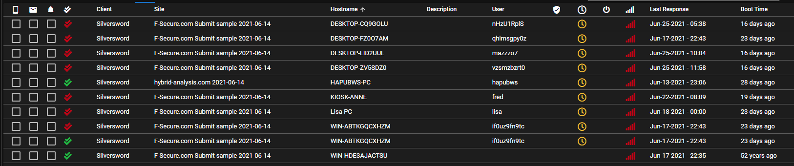
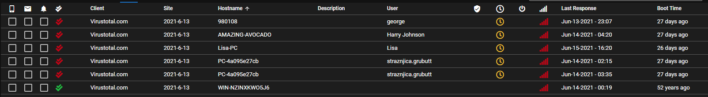
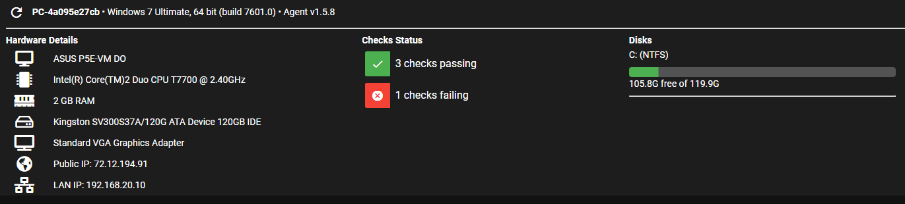
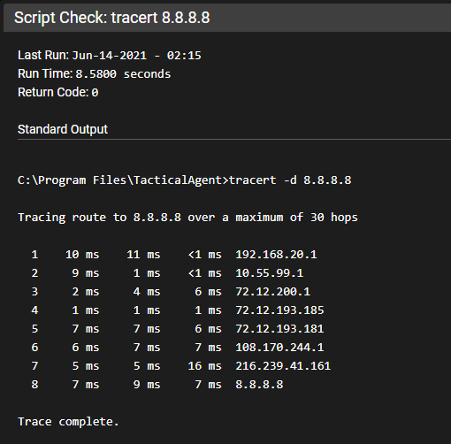
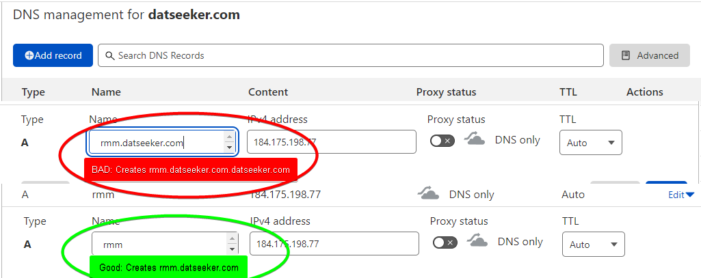

# FAQ

## Is Tactical RMM vulnerable to Log4j

No

## Why isn't the agent source available?

<https://discord.com/channels/736478043522072608/744281907361218630/925449414498222103>

It's one of those "this is why we can't have nice things". Unfortunately there are a ton of shady people out there only looking to steal and make a profit off of someone else's work and they tried very hard with tactical.

## Why isn't the Code Signing free?

It's one way we're trying to monetize and get dev's paid. We had github sponsors up for many months before code signing. Very few people donated, some $5 and $10. maybe $40 a month. Once we announced code signing, sponsors came in like crazy, and many people upgraded their $5 to a $50 so while I would like to believe people would gladly donate, that's just not the case. We already tried.

## Who is Amidaware LLC?

The Legal entity behind Tactical RMM

## Is it possible to use XXX with Tactical RMM

While it _may be possible_ to use XXX, we have not configured it and therefore it is [Unsupported](../unsupported_guidelines). We cannot help you configure XXX as it pertains to **your environment**.

## Is it possible to use XXX proxy server with Tactical RMM

If you wish to stray from the [easy install](../install_server/#option-1-easy-install) of a standard install in a VPS, you need to have the knowledge on how to troubleshoot your own custom environment.

The most common reasons you're running a proxy is:

1. Because you only have a single public IP and you already have something on Port 443. **Workaround**: Get another public IP from your ISP
2. Because you want to monitor traffic for security reasons: You're a [Networking Wizard](../unsupported_guidelines).

There are some [implementations](../unsupported_scripts) that others have done, but be aware it is [Unsupported](../unsupported_guidelines) and if you're requesting help in Discord please let us know in advance.

## How do I do X feature in the web UI?

A lot of features in the web UI are hidden behind right-click menus; almost everything has a right click menu so if you don't see something, try right clicking on it.

## Where are the Linux / Mac agents?

Linux / Mac agents are currently under development.

## Can I run Tactical RMM locally behind NAT **without** exposing my RMM server to the internet?

Yes, you will just need to setup local DNS for the 3 subdomains, either by editing host files on all your agents or through a local DNS server.

Similarly asked: Can I use onsite DNS servers (I don’t want my server accessible from the internet).

Yes, you can use (only) internal DNS (if you want) for api, mesh and rmm domains. You don't have to put these records in your public DNS servers

**Note:** You still **must** have an internet resolvable domain name and add the DNS `TXT` record to its public DNS server for the Let's Encrypt wildcard cert request process that is part of the install process. This **does not** require any inbound connection from the internet (port forwarding etc) to be enabled. This does not expose your RMM server to the internet in any way. The Let's Encrypt wildcard is done for [nats](#self-signed-certs)

## I am locked out of the web UI. How do I reset my password?

SSH into your server and run:

```bash
/rmm/api/env/bin/python /rmm/api/tacticalrmm/manage.py reset_password <username>
```

## How do I reset password or 2 factor token?

From the web UI, click **Settings > User Administration** and then right-click on a user:


???+ note "Reset Password or 2FA token"

    === ":material-ubuntu: standard"

        ```bash
        /rmm/api/env/bin/python /rmm/api/tacticalrmm/manage.py reset_2fa <username>
        ```
    === ":material-docker: docker"
        ```bash
        docker exec -it trmm-backend /bin/bash
        ```

Then simply log out of the web UI and next time the user logs in they will be redirected to the 2FA setup page which will present a barcode to be scanned with the Authenticator app.

## How do I recover my MeshCentral login credentials?

From Tactical's web UI: *Settings > Global Settings > MeshCentral*

Copy the username then ssh into the server and run:

```bash
cd /meshcentral/
sudo systemctl stop meshcentral.service
node node_modules/meshcentral --resetaccount <username> --pass <newpassword>
sudo systemctl start meshcentral.service
```

## Help! I've been hacked there are weird agents appearing in my Tactical RMM

No, you haven't.

1. Your installer was scanned by an antivirus.

2. It didn't recognize the exe.

3. You have the option enabled to submit unknown applications for analysis.

    

4. They ran it against their virtualization testing cluster.

5. You allow anyone to connect to your rmm server (you should look into techniques to hide your server from the internet).

6. Here are some examples of what that looks like.









## DNS can't find record

Q. My dns isn’t working

A. Make sure it’s correctly formatted, most DNS providers add in the domain automatically.



## Self-Signed Certs

Q. Why can’t I use a self signed certificate for web etc.

A. NATS over TLS needs a real certificate signed with a trusted root certificate.

If you aren't a dev in a non-production environment, don't run nats with self signed certs: <https://docs.nats.io/running-a-nats-service/configuration/securing_nats/tls#self-signed-certificates-for-testing>
