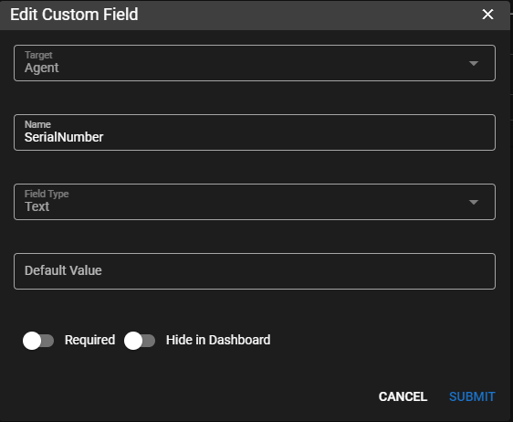
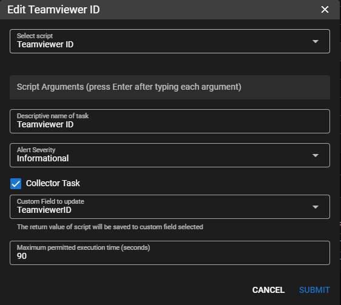
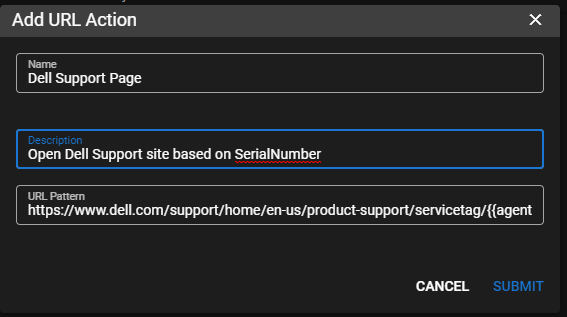

# Examples

## Create Run URL Action to Computer support page

This will create a URL link that will take you to the support page for a computer based on the computers Serial Number

1. Goto `Settings | Global Settings | Custom Fields` 
    
    Under Agents tab Add Custom Field (CaSe SeNsItIve)

    

2. Create Task (best to use `Settings | Automation Manager` if you want to apply it to all computers). Add script that has an output of the data you want.

    

3. Create URL Action (under `Settings | Global Settings | URL ACTIONS`) for Manufacturer websites

    

Dell Support Page

```
https://www.dell.com/support/home/en-us/product-support/servicetag/{{agent.SerialNumber}}/overview
```

Lenovo  Support Page

```
https://www.dell.com/support/home/en-us/product-support/servicetag/{{agent.SerialNumber}}/overview
```