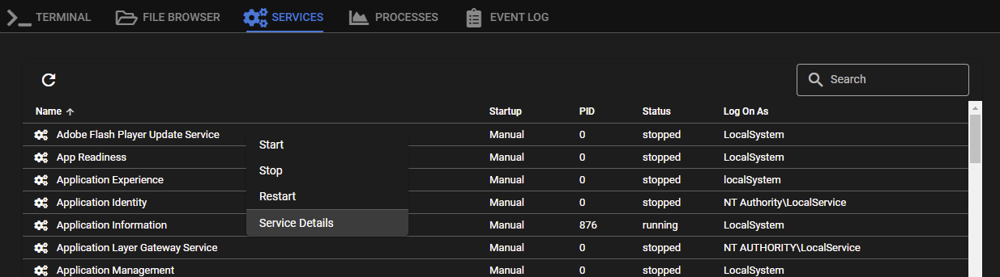
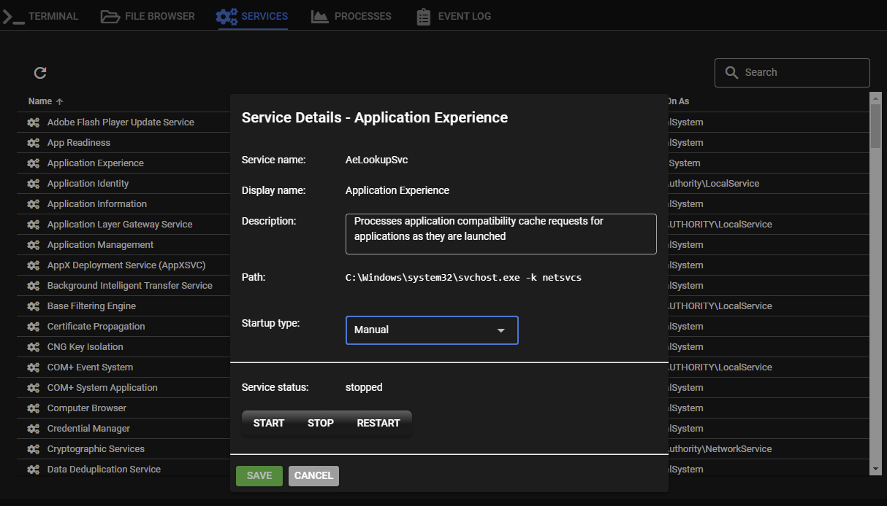
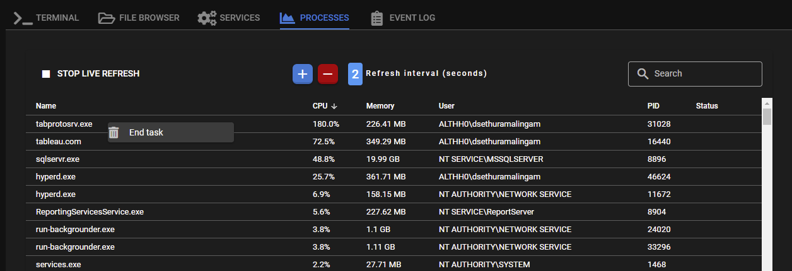

# Remote Background

To access: **Right click** on an agent > **Remote Background**

#### Services Tab

Right click on a service to show the context menu where you can start/stop/restart services:

Click *Service Details* to bring up the details tab where you can edit more service options:

#### Processes Tab

A very basic task manager that shows real time process usage.

**Right click** on a process to end the task:

