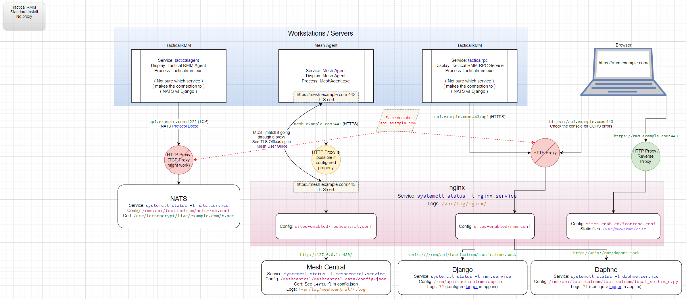

# How It All Works

## Understanding TRMM

Anything you configure: scripts, tasks, patching etc is queued and scheduled on the server to do something. 
Everything that is queued, happens immediately when agents are online.
The agent gets a nats command, server tells it to do xyz and it does it.

When agents are not connected to the server nothing happens. The windows task scheduler says do x at some time, what it's asked to do is get x command from the server. If server is offline, nothing happens.
If an agent comes online, every x interval (windows update, pending tasks etc) check and see is there something for me to do that I missed while I was offline. When that time occurs (eg agent sees if it needs to update itself at 35mins past every hr https://wh1te909.github.io/tacticalrmm/update_agents/ ) it'll get requested on the online agent.

That's the simplified general rule for everything TRMM.

[](images/TacticalRMM-Network.png)

Still need graphics for

    1. Agent installer steps

    2. Agent checks/tasks and how they work on the workstation/interact with server

## Server

Has a postgres database located here:

[Django Admin](https://wh1te909.github.io/tacticalrmm/functions/django_admin.html)

!!!description
    A web interface for the postgres database

All Tactical RMM dependencies are listed [here](https://github.com/wh1te909/tacticalrmm/blob/develop/api/tacticalrmm/requirements.txt)

### Outbound Firewall Rules

If you have strict firewall rules these are the only outbound rules from the server needed for all functionality:

1. Outbound traffic to all agent IP scopes for reflect traffic from agents

#### Server without Code Signing key

No additional rules needed

#### Server with Code Signing key

No additional rules needed

### System Services

This lists the system services used by the server.

#### nginx web server

Nginx is the web server for the `rmm`, `api`, and `mesh` domains. All sites redirect port 80 (HTTP) to port 443 (HTTPS).

!!! warning

    nginx does not serve the NATS service on port 4222.

???+ abstract "nginx configuration (a.k.a. sites available)"

    - [nginx configuration docs](https://docs.nginx.com/nginx/admin-guide/basic-functionality/managing-configuration-files/)

    === ":material-web: `rmm.example.com`"

        This serves the frontend website that you interact with.

        - Config: `/etc/nginx/sites-enabled/frontend.conf`
        - root: `/var/www/rmm/dist`
        - Access log: `/var/log/nginx/frontend-access.log`
        - Error log: `/var/log/nginx/frontend-error.log`
        - TLS certificate: `/etc/letsencrypt/live/example.com/fullchain.pem`

    === ":material-web: `api.example.com`"

        This serves the TRMM API for the frontend and agents. 

        - Config: `/etc/nginx/sites-enabled/rmm.conf`
        - roots:
            - `/rmm/api/tacticalrmm/static/`
            - `/rmm/api/tacticalrmm/tacticalrmm/private/`
        - Upstreams:
            - `unix://rmm/api/tacticalrmm/tacticalrmm.sock`
            - `unix://rmm/daphne.sock`
        - Access log: `/rmm/api/tacticalrmm/tacticalrmm/private/log/access.log`
        - Error log: `/rmm/api/tacticalrmm/tacticalrmm/private/log/error.log`
        - TLS certificate: `/etc/letsencrypt/live/example.com/fullchain.pem`

    === ":material-web: `mesh.example.com`"

        This serves MeshCentral for remote access.

        - Config: `/etc/nginx/sites-enabled/meshcentral.conf`
        - Upstream: `http://127.0.0.1:4430/`
        - Access log: `/var/log/nginx/access.log` (uses default)
        - Error log: `/var/log/nginx/error.log` (uses default)
        - TLS certificate: `/etc/letsencrypt/live/example.com/fullchain.pem`

    === ":material-web: default"

        This is the default site installed with nginx. This listens on port 80 only.

        - Config: `/etc/nginx/sites-enabled/default`
        - root: `/var/www/rmm/dist`
        - Access log: `/var/log/nginx/access.log` (uses default)
        - Error log: `/var/log/nginx/error.log` (uses default)

???+ note "systemd config"

    === ":material-console-line: status commands"

        - Status: `systemctl status --full nginx.service`
        - Stop: `systemctl stop nginx.service`
        - Start: `systemctl start nginx.service`
        - Restart: `systemctl restart nginx.service`
        - Restart: `systemctl reload nginx.service` reloads the config without restarting
        - Test config: `nginx -t`
        - Listening process: `ss -tulnp | grep nginx`

    === ":material-ubuntu: standard"

        - Service: `nginx.service`
        - Address: `0.0.0.0`
        - Port: 443
        - Exec: `/usr/sbin/nginx -g 'daemon on; master_process on;'`
        - Version: 1.18.0

    === ":material-docker: docker"

        TBD - To Be Documented

#### Tactical RMM (Django uWSGI) service

Built on the Django framework, the Tactical RMM service is the heart of the system by serving the API for the frontend and agents.

???+ note "systemd config"

    - [uWSGI docs](https://uwsgi-docs.readthedocs.io/en/latest/index.html)

    === ":material-console-line: status commands"

        - Status: `systemctl status --full rmm.service`
        - Stop: `systemctl stop rmm.service`
        - Start: `systemctl start rmm.service`
        - Restart: `systemctl restart rmm.service`
        - journalctl:
            - "tail" the logs: `journalctl --identifier uwsgi --follow`
            - View the logs: `journalctl --identifier uwsgi --since "30 minutes ago" | less`

    === ":material-ubuntu: standard"
    
        - Service: `rmm.service`
        - Socket: `/rmm/api/tacticalrmm/tacticalrmm.sock`
        - uWSGI config: `/rmm/api/tacticalrmm/app.ini`
        - Log: None
        - Journal identifier: `uwsgi`
        - Version: 2.0.18
    
    === ":material-docker: docker"
    
        TBD - To Be Documented

#### Daphne: Django channels daemon

[Daphne](https://github.com/django/daphne) is the official ASGI HTTP/WebSocket server maintained by the [Channels project](https://channels.readthedocs.io/en/stable/index.html).

???+ note "systemd config"

    - Django [Channels configuration docs](https://channels.readthedocs.io/en/stable/topics/channel_layers.html)

    === ":material-console-line: status commands"

        - Status: `systemctl status --full daphne.service`
        - Stop: `systemctl stop daphne.service`
        - Start: `systemctl start daphne.service`
        - Restart: `systemctl restart daphne.service`
        - journalctl (this provides only system start/stop logs, not the actual logs):
            - "tail" the logs: `journalctl --identifier daphne --follow`
            - View the logs: `journalctl --identifier daphne --since "30 minutes ago" | less`

    === ":material-ubuntu: standard"

        - Service: `daphne.service`
        - Socket: `/rmm/daphne.sock`
        - Exec: `/rmm/api/env/bin/daphne -u /rmm/daphne.sock tacticalrmm.asgi:application`
        - Config: `/rmm/api/tacticalrmm/tacticalrmm/local_settings.py`
        - Log: `/rmm/api/tacticalrmm/tacticalrmm/private/log/debug.log`

    === ":material-docker: docker"

        TBD - To Be Documented

#### NATS server service

[NATS](https://nats.io/) is a messaging bus for "live" communication between the agent and server. NATS provides the framework for the server to push commands to the agent and receive information back.

???+ note "systemd config"

    - [NATS server configuration docs](https://docs.nats.io/running-a-nats-service/configuration)

    === ":material-console-line: status commands"

        - Status: `systemctl status --full nats.service`
        - Stop: `systemctl stop nats.service`
        - Start: `systemctl start nats.service`
        - Restart: `systemctl restart nats.service`
        - Restart: `systemctl reload nats.service` reloads the config without restarting
        - journalctl:
            - "tail" the logs: `journalctl --identifier nats-server --follow`
            - View the logs: `journalctl --identifier nats-server --since "30 minutes ago" | less`
        - Listening process: `ss -tulnp | grep nats-server`

    === ":material-ubuntu: standard"
    
        - Service: `nats.service`
        - Address: `0.0.0.0`
        - Port: `4222`
        - Exec: `/usr/local/bin/nats-server --config /rmm/api/tacticalrmm/nats-rmm.conf`
        - Config: `/rmm/api/tacticalrmm/nats-rmm.conf`
            - TLS: `/etc/letsencrypt/live/example.com/fullchain.pem`
        - Log: None
        - Version: v2.3.3
    
    === ":material-docker: docker"
    
        - Get into bash in your docker with: `sudo docker-compose exec tactical-nats /bin/bash`
        - Log: `nats-api -log debug`

#### NATS API service

The NATS API service is a very light golang wrapper to replace traditional http requests sent to django. The agent sends the data to nats-api which is always listening for agent requests (on Port 4222). It then saves the data to postgres directly.

???+ note "systemd config"

    === ":material-console-line: status commands"

        - Status: `systemctl status --full nats-api.service`
        - Stop: `systemctl stop nats-api.service`
        - Start: `systemctl start nats-api.service`
        - Restart: `systemctl restart nats-api.service`
        - journalctl: This application does not appear to log anything.

    === ":material-ubuntu: standard"
    
         - Service: `nats-api.service`
         - Exec: `/usr/local/bin/nats-api --config /rmm/api/tacticalrmm/nats-api.conf`
         - Config: `/rmm/api/tacticalrmm/nats-api.conf`
             - TLS: `/etc/letsencrypt/live/example.com/fullchain.pem`
         - Log: None
    
    === ":material-docker: docker"
    
        TBD - To Be Documented

#### Celery service

[Celery](https://github.com/celery/celery) is a task queue focused on real-time processing and is responsible for scheduling tasks to be sent to agents.

Log located at `/var/log/celery`

???+ note "systemd config"

    - [Celery docs](https://docs.celeryproject.org/en/stable/index.html)
    - [Celery configuration docs](https://docs.celeryproject.org/en/stable/userguide/configuration.html)

    === ":material-console-line: status commands"

        - Status: `systemctl status --full celery.service`
        - Stop: `systemctl stop celery.service`
        - Start: `systemctl start celery.service`
        - Restart: `systemctl restart celery.service`
        - journalctl: Celery executes `sh` causing the systemd identifier to be `sh`, thus mixing the `celery` and `celerybeat` logs together.
            - "tail" the logs: `journalctl --identifier sh --follow`
            - View the logs: `journalctl --identifier sh --since "30 minutes ago" | less`
        - Tail logs: `tail -F /var/log/celery/w*-*.log`

    === ":material-ubuntu: standard"
    
        - Service: `celery.service`
        - Exec: `/bin/sh -c '${CELERY_BIN} -A $CELERY_APP multi start $CELERYD_NODES --pidfile=${CELERYD_PID_FILE} --logfile=${CELERYD_LOG_FILE} --loglevel="${CELERYD_LOG_LEVEL}" $CELERYD_OPTS'`
        - Config: `/etc/conf.d/celery.conf`
        - Log: `/var/log/celery/w*-*.log`
    
    === ":material-docker: docker"
    
        TBD - To Be Documented

#### Celery Beat service

[celery beat](https://github.com/celery/django-celery-beat) is a scheduler; It kicks off tasks at regular intervals, that are then executed by available worker nodes in the cluster.

???+ note "systemd config"

    - [Celery beat docs](https://docs.celeryproject.org/en/stable/userguide/periodic-tasks.html)

    === ":material-console-line: status commands"

        - Status: `systemctl status --full celerybeat.service`
        - Stop: `systemctl stop celerybeat.service`
        - Start: `systemctl start celerybeat.service`
        - Restart: `systemctl restart celerybeat.service`
        - journalctl: Celery executes `sh` causing the systemd identifier to be `sh`, thus mixing the `celery` and `celerybeat` logs together.
            - "tail" the logs: `journalctl --identifier sh --follow`
            - View the logs: `journalctl --identifier sh --since "30 minutes ago" | less`
        - Tail logs: `tail -F /var/log/celery/beat.log`

    === ":material-ubuntu: standard"
    
        - Service: `celerybeat.service`
        - Exec: `/bin/sh -c '${CELERY_BIN} -A ${CELERY_APP} beat --pidfile=${CELERYBEAT_PID_FILE} --logfile=${CELERYBEAT_LOG_FILE} --loglevel=${CELERYD_LOG_LEVEL}'`
        - Config: `/etc/conf.d/celery.conf`
        - Log: `/var/log/celery/beat.log`
    
    === ":material-docker: docker"
    
        TBD - To Be Documented

#### MeshCentral

[MeshCentral](https://github.com/Ylianst/MeshCentral) is used for: "Take Control" (connecting to machine for remote access), and 2 screens of the "Remote Background" (Terminal, and File Browser).

???+ note "meshcentral"

    - [MeshCentral docs](https://info.meshcentral.com/downloads/MeshCentral2/MeshCentral2UserGuide.pdf)

    === ":material-console-line: status commands"

        - Status: `systemctl status --full meshcentral`
        - Stop: `systemctl stop meshcentral`
        - Start: `systemctl start meshcentral`
        - Restart: `systemctl restart meshcentral`

    === ":material-remote-desktop: Debugging"

        - Open either "Take Control" or "Remote Background" to get mesh login token
        - Open https://mesh.example.com to open native mesh admin interface
        - Left-side "My Server" > Choose "Console" > type `agentstats`
        - To view detailed logging goto "Trace" > click Tracing button and choose categories

### Other Dependencies

[Django](https://www.djangoproject.com/) - Framework to integrate the server to interact with browser.

<details>
  <summary>Django dependencies</summary>

```text
future==0.18.2
loguru==0.5.3
msgpack==1.0.2
packaging==20.9
psycopg2-binary==2.9.1
pycparser==2.20
pycryptodome==3.10.1
pyotp==2.6.0
pyparsing==2.4.7
pytz==2021.1
```
</details>

[qrcode](https://pypi.org/project/qrcode/) - Creating QR codes for 2FA.

<details>
  <summary>qrcode dependencies</summary>

```text
redis==3.5.3
requests==2.25.1
six==1.16.0
sqlparse==0.4.1
```
</details>

[twilio](https://www.twilio.com/) - Python SMS notification integration.

<details>
  <summary>twilio dependencies</summary>

```text
urllib3==1.26.5
uWSGI==2.0.19.1
validators==0.18.2
vine==5.0.0
websockets==9.1
zipp==3.4.1
```
</details>


## Windows Agent

Found in `%programfiles%\TacticalAgent`

When scripts/checks execute, they are:

1. transferred from the server via nats
2. saved to a randomly created file in `c:\windows\temp\trmm\`
3. executed
4. Return info is captured and returned to the server via nats
5. File in `c:\windows\temp\trmm\` are removed automatically after execution/timeout.

### Outbound Firewall Rules

If you have strict firewall rules these are the only outbound rules from the agent needed for all functionality:

1. All agents have to be able to connect outbound to TRMM server on the 3 domain names on ports: 443 (agent and mesh) and 4222 (nats for checks/tasks/data)

2. The agent uses `https://icanhazip.tacticalrmm.io/` to get public IP info. If this site is down for whatever reason, the agent will fallback to `https://icanhazip.com` and then `https://ifconfig.co/ip`

#### Unsigned Agents

Unsigned agents require access to: `https://github.com/wh1te909/rmmagent/releases/*`

#### Signed Agents

Signed agents will require: `https://exe.tacticalrmm.io/` and `https://exe2.tacticalrmm.io/` for downloading/updating agents

### Services

3 services exist on all clients

* `Mesh Agent`


**AND**

* `TacticalAgent` and `Tactical RMM RPC Service`


The [MeshCentral](https://meshcentral.com/) system which is accessible from `https://mesh.example.com` and is used

* It runs 2 goroutines
  * one is the checkrunner which runs all the checks and then just sleeps until it's time to run more checks
  * 2nd goroutine periodically sends info about the agent to the rmm and also handles agent recovery

!!!note
    In Task Manager you will see additional `Tactical RMM Agent` processes appear and disappear. These are your Checks and Tasks running at scheduled intervals

`Tactical RMM RPC Service`

* Uses the pub/sub model so anytime you do anything realtime from rmm (like a send command or run script)
* It maintains a persistent connection to your to the api.example.com rmm server on `port:4222` and is listening for events (using [nats](https://nats.io/))
* It handles your Agent updates (Auto triggers at 35mins past every hour or when run manually from server Agents | Update Agents menu)

***

### Agent Installation Process

* Adds Defender AV exclusions
* Copies temp files to `c:\windows\temp\tacticalxxx` folder.
* INNO setup installs app into `%ProgramData%\TacticalAgent\` folder

***

### Agent Update Process

Downloads latest `winagent-vx.x.x-x86/64.exe` to `%programfiles%`

Executes the file (INNO setup exe)

Files create `c:\Windows\temp\Tacticalxxxx\` folder for install (and log files)

***

### Agent Debugging

You can temporarily log to screen, or log to file

???+ note "Debugging Options"

    === ":material-math-log: Manual One Time"

        Stop the services

        ```cmd
        net stop tacticalagent
        net stop tacticalrpc
        ```

        Then run either Agent:

        Run the tacticalagent service manually with debug logging:

        ```cmd
        "C:\Program Files\TacticalAgent\tacticalrmm.exe" -m winagentsvc -log debug -logto stdout
        ```

        Run the tacticalrpc service manually with debug logging:

        ```cmd
        "C:\Program Files\TacticalAgent\tacticalrmm.exe" -m rpc -log debug -logto stdout
        ```

    === ":material-math-log: Log debug to file"

        TacticalAgent
        
        Stop the service

        ```cmd
        net stop tacticalagent
        ```

        Edit the service: `TacticalAgent`

        ```cmd
        cd "c:\Program Files\TacticalAgent"
        nssm.exe edit tacticalagent
        ```

        Add options `-m winagentsvc -log debug`

        TacticalAgent: Start the service
        ```cmd
        net start tacticalagent
        ```

        It will debug log to `"C:\Program Files\TacticalAgent\agent.log"`

        **AND/OR**

        Tacticalrpc
        
        Stop the service

        ```cmd
        net stop tacticalrpc
        ```

        Edit the service: `Tacticalrpc`

        ```cmd
        cd "c:\Program Files\Tacticalrpc"
        nssm.exe edit tacticalrpc
        ```

        Add options `-m rpc -log debug`

        Tacticalrpc: Start the service
        ```cmd
        net start tacticalrpc
        ```

        It will debug log to `"C:\Program Files\TacticalAgent\agent.log"`


#### Mesh Agent Recovery

Tactical Agent just runs `mesh_agent.exe -something` to get the mesh agent id and saves it to the django database.

#### Tactical RPC Recovery

#### Tactical Agent Recovery

### Windows Update Management

Tactical RMM Agent sets:

```reg
HKEY_LOCAL_MACHINE\SOFTWARE\Policies\Microsoft\Windows\WindowsUpdate\AU
AUOptions (REG_DWORD):
1: Keep my computer up to date is disabled in Automatic Updates.
```

Uses this Microsoft API to handle updates: [https://docs.microsoft.com/en-us/windows/win32/api/_wua/](https://docs.microsoft.com/en-us/windows/win32/api/_wua/)

### Log files

You can find 3 sets of detailed logs at `/rmm/api/tacticalrmm/tacticalrmm/private/log`

* `error.log` nginx log for all errors on all TRMM URL's: rmm, api and mesh

* `access.log` nginx log for access auditing on all URL's: rmm, api and mesh (_this is a large file, and should be cleaned periodically_)

* `django_debug.log` created by django webapp
