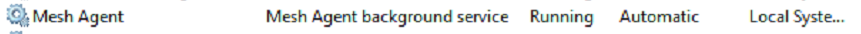
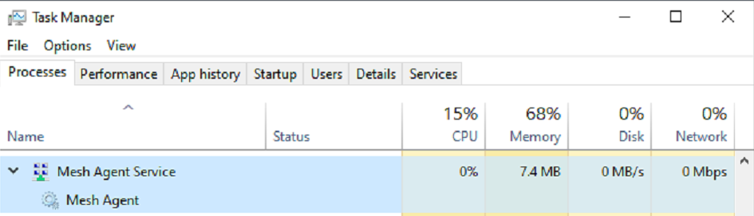
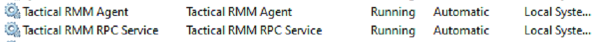
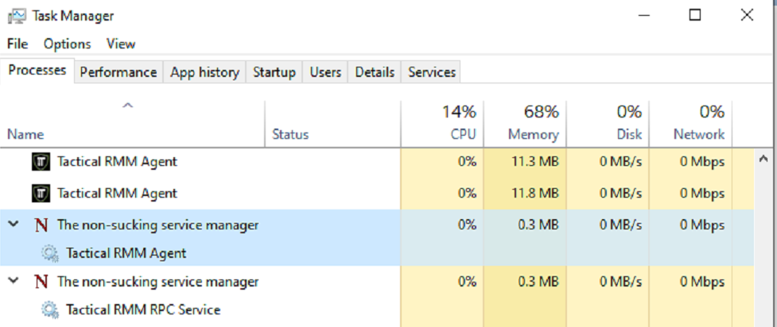

# How It All Works

INSERT WIREFRAME GRAPHIC HERE USING <https://www.yworks.com/yed-live/>

## Server

Has a postgres database located here:

[Django Admin](https://wh1te909.github.io/tacticalrmm/functions/django_admin.html)

!!!description
    A web interface for the postgres database

### Services

nginx

!!!description
    Web server that handles https traffic

Log located at `/var/log/nginx`

```bash
tail /var/log/nginx
```

### Dependencies from [here](https://github.com/wh1te909/tacticalrmm/blob/develop/api/tacticalrmm/requirements.txt)

[nats](https://nats.io/)

How communication between client and server bride NAT (Network Address Translation)

[celery](https://github.com/celery/celery)

!!!description
    Used to schedule tasks to be sent to Agent

Log located at `/var/log/celery`

```bash
tail /var/log/celery
```

[Django](https://www.djangoproject.com/)

!!!description
    Framework to integrate the server to interact with browser

future==0.18.2
loguru==0.5.3
msgpack==1.0.2
packaging==20.9
psycopg2-binary==2.9.1
pycparser==2.20
pycryptodome==3.10.1
pyotp==2.6.0
pyparsing==2.4.7
pytz==2021.1

[qrcode](https://pypi.org/project/qrcode/)

!!!description
    For creating QR codes for 2FA

redis==3.5.3
requests==2.25.1
six==1.16.0
sqlparse==0.4.1

[twilio](https://www.twilio.com/)

!!!description
    Python SMS notification integration

urllib3==1.26.5
uWSGI==2.0.19.1
validators==0.18.2
vine==5.0.0
websockets==9.1
zipp==3.4.1

## Windows Agent

Found in `%programfiles%\TacticalAgent`

### Services

3 services exist on all clients

* `Mesh Agent`



**AND**

* `TacticalAgent` and `Tactical RMM RPC Service`



The [MeshCentral](https://meshcentral.com/) system which is accessible from <https://mesh.example.com> and is used

* It runs 2 goroutines
  * one is the checkrunner which runs all the checks and then just sleeps until it's time to run more checks
  * 2nd goroutine periodically sends info about the agent to the rmm and also handles agent recovery

!!!note
    In Task Manager you will see additional `Tactical RMM Agent` processes appear and disappear. These are your Checks and Tasks running at scheduled intervals

`Tactical RMM RPC Service`

* Uses the pub/sub model so anytime you do anything realtime from rmm (like a send command or run script)
* It maintains a persistent connection to your to the api.example.com rmm server on `port:4222` and is listening for events (using [nats](https://nats.io/))
* It handles your Agent updates (Auto triggers at 35mins past every hour or when run manually from server Agents | Update Agents menu)

***

### Agent Installation Process

* Adds Defender AV exclusions
* Copies temp files to `c:\windows\temp\tacticalxxx` folder.
* INNO setup installs app into `%ProgramData%\TacticalAgent\` folder

***

### Agent Update Process

Downloads latest `winagent-vx.x.x-x86/64.exe` to `%programfiles%`

Executes the file (INNO setup exe)

Files create `c:\Windows\temp\Tacticalxxxx\` folder for install (and log files)

*****

### Windows Update Management

Tactical RMM Agent sets:

```reg
HKEY_LOCAL_MACHINE\SOFTWARE\Policies\Microsoft\Windows\WindowsUpdate\AU
AUOptions (REG_DWORD):
1: Keep my computer up to date is disabled in Automatic Updates.
```

Uses this Microsoft API to handle updates: [https://docs.microsoft.com/en-us/windows/win32/api/_wua/](https://docs.microsoft.com/en-us/windows/win32/api/_wua/)