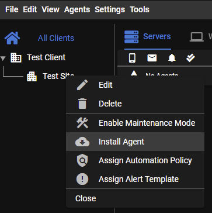
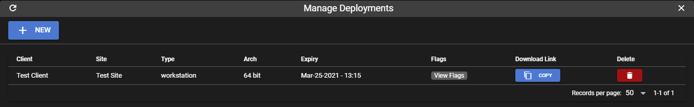

# Installing an agent

!!!warning
    If you don't want to deal with AV flagging/deleting your agents, check the instructions for getting [code signed agents](code_signing.md)<br/><br />
    You must add antivirus exlusions for the tactical agent.<br/>
    Any decent AV will flag the agent as a virus, since it technically is one due to the nature of this software.<br/>
    Adding the following exlucions will make sure everything works, including agent update:<br/>
    `C:\Program Files\TacticalAgent\*`<br/>
    `C:\Program Files\Mesh Agent\*`<br/>
    `C:\Windows\Temp\winagent-v*.exe`<br/>
    `C:\Windows\Temp\trmm\*`<br/>
    


#### Dynamically generated executable

The generated exe is simply a wrapper around the Manual install method, using a single exe/command without the need to pass any command line flags to the installer.<br/><br/>
All it does is download the generic installer from the agent's github [release page](https://github.com/wh1te909/rmmagent/releases) and call it using predefined command line args that you choose from the web UI.<br/><br/>
It "bakes" the command line args into the executable.<br/><br/>
From the UI, click **Agents > Install Agent**<br/>
You can also **right click on a site > Install Agent**. This will automatically fill in the client/site dropdown for you.<br/><br/>


#### Powershell
The powershell method is very similar to the generated exe in that it simply downloads the installer from github and calls the exe for you.

#### Manual
The manual installation method requires you to first download the generic installer and call it using command line args.<br/><br/>
This is useful for scripting the installation using Group Policy or some other batch deployment method.<br/>


!!!tip
    You can reuse the installer for any of the deployment methods, you don't need to constantly create a new installer for each new agent.<br/>
    The installer will be valid for however long you specify the token expiry time when generating an agent.

<br/>
#### Using a deployment link

Creating a deployment link is the recommended way to deploy agents.<br/><br/>
The main benefit of this method is that the exectuable is generated only whenever the deployment download link is accessed, whereas with the other methods it's generated right away and the agent's version hardcoded into the exe.<br/><br/>
Using a deployment link will allow you to not worry about installing using an older version of an agent, which will fail to install if you have updated your RMM to a version that is not compatible with an older installer you might have lying around.<br/><br/>

To create a deployment, from the web UI click **Agents > Manage Deployments**.<br/><br/>



!!!tip
    Create a client/site named "Default" and create a deployment for it with a very long expiry to have a generic installer that can be deployed anytime at any client/site.<br/><br/>
    You can then move the agent into the correct client/site from the web UI after it's been installed.

Copy/paste the download link from the deployment into your browser. It will take a few seconds to dynamically generate the executable and then your browser will automatically download the exe.


#### Optional installer args

The following optional arguments can be passed to any of the installation method executables:

```
-log debug
```
Will print very verbose logging during agent install. Useful for troubleshooting agent install.

```
-silent
```
This will not popup any message boxes during install, either any error messages or the "Installation was successfull" message box that pops up at the end of a successfull install.

```
-proxy "http://proxyserver:port"
```
Use a http proxy

```
-meshdir "C:\Program Files\Your Company Name\Mesh Agent"
```
Specify the full path to the directory containing `MeshAgent.exe` if using custom agent branding for your MeshCentral instance.

```
-nomesh
```
Do not install meshcentral agent during tactical agent install. Note: take control, remote terminal and file browser will not work.