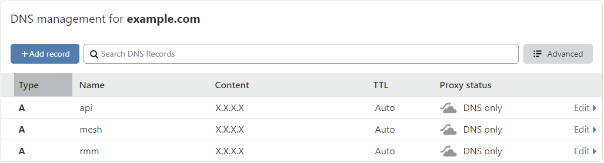
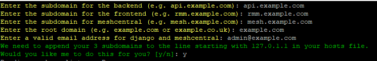
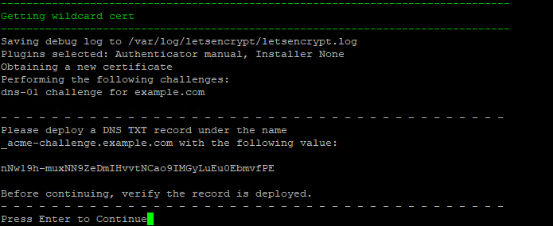
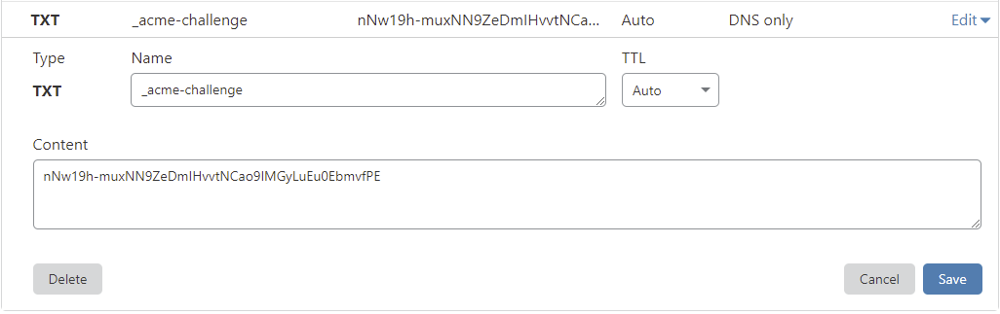
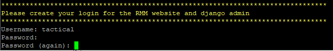
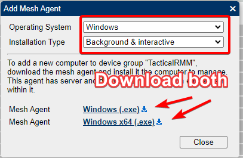

# Installation

## Minimum requirements
- A fresh linux VM running either Ubuntu 20.04 or Debian 10, with a minimum of 2GB RAM.<br/>

!!!warning
    The provided install script assumes a fresh server with no software installed on it. Attempting to run it on an existing server with other services **will** break things and the install will fail.<br/><br/>
    The install script has been tested on the following public cloud providers: DigitalOcean, Linode, Vultr, BuyVM (highly recommended), Hetzner, AWS, Google Cloud and Azure, as well as behind NAT on Hyper-V, Proxmox and ESXi.

- A real (internet resolvable) domain is needed to generate a Let's Encrypt wildcard cert. <br/>If you cannot afford to purchase a domain ($12 a year) then you can get one for free at [freenom.com](https://www.freenom.com/)
- example.local is __NOT__ a real domain. No you [don't have to expose your server](faq.md#can-i-run-tactical-rmm-locally-behind-nat-without-exposing-anything-to-the-internet) to the internet<br/><br/>

- A TOTP based authenticator app. Some popular ones are Google Authenticator, Authy and Microsoft Authenticator.<br/><br/>

## Install

!!!info
    It is recommended that you keep your server updated regularly (monthly). SSL wildcard certs will expire every 3 months and need manual updating as well. <br/><br/>
    Until we reach production release, there may be architectural changes that may be made to Tactical RMM and only a regular patching schedule is supported by developers.

#### Run updates and setup the linux user
SSH into the server as **root**.<br/><br/>
Download and run the prereqs and latest updates<br/>
```bash
apt update
apt install -y wget curl sudo
apt -y upgrade
```
If a new kernel is installed, then reboot the server with the `reboot` command<br/><br/>
Create a linux user named `tactical` to run the rmm and add it to the sudoers group.<br/>

**For Ubuntu**:
```bash
adduser tactical
usermod -a -G sudo tactical
```

**For Debian**:
```bash
useradd -m -s /bin/bash tactical
usermod -a -G sudo tactical
```

!!!tip
    [Enable passwordless sudo to make your life easier](https://linuxconfig.org/configure-sudo-without-password-on-ubuntu-20-04-focal-fossa-linux)

#### Setup the firewall (optional but highly recommended)

!!!info
    Skip this step if your VM is __not__ publicly exposed to the world e.g. running behind NAT. You should setup the firewall rules in your router instead (ports 22, 443 and 4222 TCP).

```bash
ufw default deny incoming
ufw default allow outgoing
ufw allow https
ufw allow proto tcp from any to any port 4222
```

!!!info
    SSH (port 22 tcp) is only required for you to remotely login and do basic linux server administration for your rmm. It is not needed for any agent communication.<br/>
Allow ssh from everywhere (__not__ recommended)
```bash
ufw allow ssh
```

Allow ssh from only allowed IP's (__highly__ recommended)
```bash
ufw allow proto tcp from X.X.X.X to any port 22
ufw allow proto tcp from X.X.X.X to any port 22
```

Enable and activate the firewall
```
ufw enable && ufw reload
```

#### Create the A records

We'll be using `example.com` as our domain for this example.

!!!info
    The RMM uses 3 different sites. The Vue frontend e.g. `rmm.example.com` which is where you'll be accesing your RMM from the browser, the REST backend e.g. `api.example.com` and Meshcentral e.g. `mesh.example.com`


Get the public IP of your server with `curl https://icanhazip.tacticalrmm.io`<br/>
Open the DNS manager of wherever the domain you purchased is hosted.<br/>
Create 3 A records: `rmm`, `api` and `mesh` and point them to the public IP of your server:




#### Run the install script

Switch to the `tactical` user
```bash
su - tactical
```

Download and run the install script
```bash
wget https://raw.githubusercontent.com/wh1te909/tacticalrmm/master/install.sh
chmod +x install.sh
./install.sh
```

Answer the initial questions when prompted. Replace `example.com` with your domain.




#### Deploy the TXT record in your DNS manager:

!!!warning
    TXT records can take anywhere from 1 minute to a few hours to propogate depending on your DNS provider.<br/>
    You should verify the TXT record has been deployed first before pressing Enter.<br/>
    A quick way to check is with the following command:<br/> `dig -t txt _acme-challenge.example.com`





Create a login for the RMM web UI:



A bunch of URLS / usernames / passwords will be printed out at the end of the install script. **Save these somewhere safe.** [Recover them if you didn't](faq.md#how-do-i-recover-my-meshcentral-login-credentials)


Copy the url for the meshagent exe (`https://mesh.example.com/agentinvite?c=......`), paste it in your browser and download the mesh agent:



Navigate to `https://rmm.example.com` and login with the username/password you created during install.<br/><br/>
Once logged in, you will be redirected to the initial setup page.<br/><br/>
Create your first client/site, choose the default timezone and then upload the mesh agent you just downloaded.

!!!note
    Though it is an unsupported configuration, if you are using HAProxy or wish to configure fail2ban this might be of use to you [Unsupported Configuration Notes](unsupported_scripts.md)