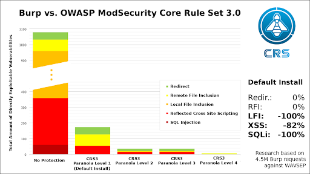

# DISCLAIMER

All the settings covered in this document have been tested against Tactical RMM v0.7.2 and v0.8.0.

Before applying these settings in production, use a pre-production environment so potential disruptions in your own environment and the service that you provide to your clients can be avoided.

!!!warning
        **<span style="text-decoration:underline;">Use the contents included in this guide and apply the security settings detailed here at your own discretion.</span>**

## Intro

This section is structured in three main subsections:

* Enabling GeoIP in NGINX config with the purpose of filtering (blocking) web requests based on the country’s source IP.
* Enabling anti “bad” bots/referrers in HTTP requests to the NGINX server.
* Compiling and enabling ModSec + OWASP CRS in NGINX server.

Each section can be enabled independently.

## Hardening NGINX settings

### GeoIP Integration in NGINX - Blocking Requests by Country Code

Install required packages and NGINX module for GeoIP:

```bash
# apt-get install geoip-database libgeoip1 libnginx-mod-http-geoip
```

Verify that the GeoIP database files have been placed in the right location:

```bash
# ls -lrt /usr/share/GeoIP/
total 10004
-rw-r--r-- 1 root root 8138841 Jan 24  2020 GeoIPv6.dat
-rw-r--r-- 1 root root 2099217 Jan 24  2020 GeoIP.dat
```

Edit NGINX config file (“/etc/nginx/nginx.conf”) and add the following config under the “http {“ block:

```conf
http {

        ##
        # Basic Settings
        ##
        # Load GeoIP Database
        geoip_country /usr/share/GeoIP/GeoIP.dat;

```

The next settings will depend on the desired GeoIP blocking strategy. For “allow by default, deny by exception”, the config would be:

```conf
http {

        ##
        # Basic Settings
        ##
        # Load GeoIP Database
        geoip_country /usr/share/GeoIP/GeoIP.dat;
        # map the list of denied countries
        map $geoip_country_code $allowed_country {
        default yes;
        # BLOCKED_COUNTRY_1
        COUNTRY_CODE_1 no;
        # BLOCKED_COUNTRY_2
        COUNTRY_CODE_2 no;
        # BLOCKED_COUNTRY_3
        COUNTRY_CODE_3 no;
        }

```

(The macro can be modified to achieve the “deny by default, allow by exception” approach).

Finally, the following “if” statement needs to be placed in all the vhosts where the GeoIP blocking should take effect, under the “location” section:

```conf
   location / {
        root /var/www/rmm/dist;
        try_files $uri $uri/ /index.html;
        add_header Cache-Control "no-store, no-cache, must-revalidate";
        add_header Pragma "no-cache";
        # block the country
        if ($allowed_country = no) {
         return 444;
        }
    }

```

The HTTP Status = 444 is a good choice for NGINX not “wasting” too many resources in sending back the 4xx code to the client being blocked by GeoIP.

### Blocking “bad bots” and “bad referrers”

Nginx Bad Bot and User-Agent Blocker, Spam Referrer Blocker, Anti DDOS, Bad IP Blocker and Wordpress Theme Detector Blocker

Source:

[https://github.com/mitchellkrogza/nginx-ultimate-bad-bot-blocker](https://github.com/mitchellkrogza/nginx-ultimate-bad-bot-blocker)

Download “install-ngxblocker” to your /usr/local/sbin/directory and make the script executable.

```bash
sudo wget https://raw.githubusercontent.com/mitchellkrogza/nginx-ultimate-bad-bot-blocker/master/install-ngxblocker -O /usr/local/sbin/install-ngxblocker
sudo chmod +x /usr/local/sbin/install-ngxblocker
```

**<span style="text-decoration:underline;">(OPTIONAL)</span>**Now run the ”install-ngxblocker” script in **DRY-MODE** which will show you what changes it will make and what files it will download for you. This is only a DRY-RUN so no changes are being made yet.

The install-ngxblocker downloads all required files including the setup and update scripts.

```bash
cd /usr/local/sbin
sudo ./install-ngxblocker
```

This will show you output as follows of the changes that will be made (NOTE: this is only a **DRY-RUN** no changes have been made)

```log
Checking url: https://raw.githubusercontent.com/mitchellkrogza/nginx-ultimate-bad-bot-blocker/master/include_filelist.txt
** Dry Run ** | not updating files | run  as 'install-ngxblocker -x' to install files.
Creating directory: /etc/nginx/bots.d
REPO = https://raw.githubusercontent.com/mitchellkrogza/nginx-ultimate-bad-bot-blocker/master
Downloading [FROM]=>  [REPO]/conf.d/globalblacklist.conf            [TO]=>  /etc/nginx/conf.d/globalblacklist.conf
Downloading [FROM]=>  [REPO]/conf.d/botblocker-nginx-settings.conf  [TO]=>  /etc/nginx/conf.d/botblocker-nginx-settings.conf
REPO = https://raw.githubusercontent.com/mitchellkrogza/nginx-ultimate-bad-bot-blocker/master
Downloading [FROM]=>  [REPO]/bots.d/blockbots.conf              [TO]=>  /etc/nginx/bots.d/blockbots.conf
Downloading [FROM]=>  [REPO]/bots.d/ddos.conf                   [TO]=>  /etc/nginx/bots.d/ddos.conf
Downloading [FROM]=>  [REPO]/bots.d/whitelist-ips.conf          [TO]=>  /etc/nginx/bots.d/whitelist-ips.conf
Downloading [FROM]=>  [REPO]/bots.d/whitelist-domains.conf      [TO]=>  /etc/nginx/bots.d/whitelist-domains.conf
Downloading [FROM]=>  [REPO]/bots.d/blacklist-user-agents.conf  [TO]=>  /etc/nginx/bots.d/blacklist-user-agents.conf
Downloading [FROM]=>  [REPO]/bots.d/blacklist-ips.conf          [TO]=>  /etc/nginx/bots.d/blacklist-ips.conf
Downloading [FROM]=>  [REPO]/bots.d/bad-referrer-words.conf     [TO]=>  /etc/nginx/bots.d/bad-referrer-words.conf
Downloading [FROM]=>  [REPO]/bots.d/custom-bad-referrers.conf   [TO]=>  /etc/nginx/bots.d/custom-bad-referrers.conf
REPO = https://raw.githubusercontent.com/mitchellkrogza/nginx-ultimate-bad-bot-blocker/master
Downloading [FROM]=>  [REPO]/setup-ngxblocker      [TO]=>  /usr/local/sbin/setup-ngxblocker
Downloading [FROM]=>  [REPO]/update-ngxblocker     [TO]=>  /usr/local/sbin/update-ngxblocker
```

Now run the install script with the -x parameter to download all the necessary files from the repository:

```bash
cd /usr/local/sbin/
sudo ./install-ngxblocker -x
```

This will give you the following output:

```log
Checking url: https://raw.githubusercontent.com/mitchellkrogza/nginx-ultimate-bad-bot-blocker/master/include_filelist.txt
Creating directory: /etc/nginx/bots.d
REPO = https://raw.githubusercontent.com/mitchellkrogza/nginx-ultimate-bad-bot-blocker/master
Downloading [FROM]=>  [REPO]/conf.d/globalblacklist.conf            [TO]=>  /etc/nginx/conf.d/globalblacklist.conf...OK
Downloading [FROM]=>  [REPO]/conf.d/botblocker-nginx-settings.conf  [TO]=>  /etc/nginx/conf.d/botblocker-nginx-settings.conf...OK
REPO = https://raw.githubusercontent.com/mitchellkrogza/nginx-ultimate-bad-bot-blocker/master
Downloading [FROM]=>  [REPO]/bots.d/blockbots.conf              [TO]=>  /etc/nginx/bots.d/blockbots.conf...OK
Downloading [FROM]=>  [REPO]/bots.d/ddos.conf                   [TO]=>  /etc/nginx/bots.d/ddos.conf...OK
Downloading [FROM]=>  [REPO]/bots.d/whitelist-ips.conf          [TO]=>  /etc/nginx/bots.d/whitelist-ips.conf...OK
Downloading [FROM]=>  [REPO]/bots.d/whitelist-domains.conf      [TO]=>  /etc/nginx/bots.d/whitelist-domains.conf...OK
Downloading [FROM]=>  [REPO]/bots.d/blacklist-user-agents.conf  [TO]=>  /etc/nginx/bots.d/blacklist-user-agents.conf...OK
Downloading [FROM]=>  [REPO]/bots.d/blacklist-ips.conf          [TO]=>  /etc/nginx/bots.d/blacklist-ips.conf...OK
Downloading [FROM]=>  [REPO]/bots.d/bad-referrer-words.conf     [TO]=>  /etc/nginx/bots.d/bad-referrer-words.conf...OK
Downloading [FROM]=>  [REPO]/bots.d/custom-bad-referrers.conf   [TO]=>  /etc/nginx/bots.d/custom-bad-referrers.conf...OK
REPO = https://raw.githubusercontent.com/mitchellkrogza/nginx-ultimate-bad-bot-blocker/master
Downloading [FROM]=>  [REPO]/setup-ngxblocker      [TO]=>  /usr/local/sbin/setup-ngxblocker...OK
Downloading [FROM]=>  [REPO]/update-ngxblocker     [TO]=>  /usr/local/sbin/update-ngxblocker...OK
```

All the required files have now been downloaded to the correct folders on Nginx for you direct from the repository.

**<span style="text-decoration:underline;">NOTE:</span>** The setup and update scripts can be used, however in this guide the config is done manually. For script execution, refer to the Github page linked above.

Include any public IP addresses that should be whitelisted from bot and referrer analysis/blocking by editing the file “/etc/nginx/bots.d/whitelist-ips.conf”.

Finally, edit every vhost file (“/etc/nginx/sites-enabled/frontend.conf”, “/etc/nginx/sites-enabled/rmm.conf” and “/etc/nginx/sites-enabled/meshcentral.conf”) and place the following include statements under the “server” block:

```conf
server {
    listen 443 ssl;
    include /etc/nginx/bots.d/ddos.conf;
    include /etc/nginx/bots.d/blockbots.conf;
```

## Enabling ModSec in NGINX

All steps in this section taken from the NGINX blog post “Compiling and Installing ModSecurity for NGINX Open Source”:

[https://www.nginx.com/blog/compiling-and-installing-modsecurity-for-open-source-nginx/](https://www.nginx.com/blog/compiling-and-installing-modsecurity-for-open-source-nginx/)

### Install Prerequisite Packages

The first step is to install the packages required to complete the remaining steps in this tutorial. Run the following command, which is appropriate for a freshly installed Ubuntu/Debian system. The required packages might be different for RHEL/CentOS/Oracle Linux.

```bash
apt-get install -y apt-utils autoconf automake build-essential git libcurl4-openssl-dev libgeoip-dev liblmdb-dev libpcre++-dev libtool libxml2-dev libyajl-dev pkgconf wget zlib1g-dev
```

### Download and Compile the ModSecurity 3.0 Source Code

With the required prerequisite packages installed, the next step is to compile ModSecurity as an NGINX dynamic module. In ModSecurity 3.0’s new modular architecture, libmodsecurity is the core component which includes all rules and functionality. The second main component in the architecture is a connector that links libmodsecurity to the web server it is running with. There are separate connectors for NGINX, Apache HTTP Server, and IIS. We cover the NGINX connector in the next section.

To compile libmodsecurity:

Clone the GitHub repository:

```bash
git clone --depth 1 -b v3/master --single-branch https://github.com/SpiderLabs/ModSecurity
```

Change to the ModSecurity directory and compile the source code:

```bash
cd ModSecurity
git submodule init
git submodule update
./build.sh
./configure
make
make install
cd ..
```

The compilation takes about 15 minutes, depending on the processing power of your system.

Note: It’s safe to ignore messages like the following during the build process. Even when they appear, the compilation completes and creates a working object.

```log
fatal: No names found, cannot describe anything.
```

### Download the NGINX Connector for ModSecurity and Compile It as a Dynamic Module

Compile the ModSecurity connector for NGINX as a dynamic module for NGINX.

Clone the GitHub repository:

```bash
git clone --depth 1 https://github.com/SpiderLabs/ModSecurity-nginx.git
```

Determine which version of NGINX is running on the host where the ModSecurity module will be loaded:

```bash
$ nginx -v
nginx version: nginx/1.18.0 (Ubuntu)
```

Download the source code corresponding to the installed version of NGINX (the complete sources are required even though only the dynamic module is being compiled):

```bash
wget http://nginx.org/download/nginx-1.18.0.tar.gz
tar zxvf nginx-1.18.0.tar.gz
```

Compile the dynamic module and copy it to the standard directory for modules:

```bash
cd nginx-1.18.0
./configure --with-compat --add-dynamic-module=../ModSecurity-nginx
make modules
cp objs/ngx_http_modsecurity_module.so /etc/nginx/modules
cp objs/ngx_http_modsecurity_module.so /usr/share/nginx/modules/
cd ..
```

### Load the NGINX ModSecurity Connector Dynamic Module

Add the following load_module directive to the main (top‑level) context in /etc/nginx/nginx.conf. It instructs NGINX to load the ModSecurity dynamic module when it processes the configuration:

```conf
load_module modules/ngx_http_modsecurity_module.so;
```

### Configure and Enable ModSecurity

The final step is to enable and test ModSecurity.

Set up the appropriate ModSecurity configuration file. Here we’re using the recommended ModSecurity configuration provided by TrustWave Spiderlabs, the corporate sponsors of ModSecurity.

```bash
mkdir /etc/nginx/modsec
wget -P /etc/nginx/modsec/ https://raw.githubusercontent.com/SpiderLabs/ModSecurity/v3/master/modsecurity.conf-recommended
mv /etc/nginx/modsec/modsecurity.conf-recommended /etc/nginx/modsec/modsecurity.conf
```

To guarantee that ModSecurity can find the unicode.mapping file (distributed in the top‑level ModSecurity directory of the GitHub repo), copy it to /etc/nginx/modsec.

```bash
cp ModSecurity/unicode.mapping /etc/nginx/modsec
```

Change the SecRuleEngine directive in the configuration to change from the default “detection only” mode to actively dropping malicious traffic.

```conf
#SecRuleEngine DetectionOnly
SecRuleEngine On
```

## Enabling OWASP Core Rule Set

Clone OWASP CRS:

```bash
cd /etc/nginx/modsec
git clone https://github.com/coreruleset/coreruleset.git
```

Create CRS setup config file:

```bash
cp /etc/nginx/modsec/coreruleset/crs-setup.conf.example /etc/nginx/modsec/coreruleset/crs-setup.conf
```

Edit config file and enable a paranoia level of 2 (comment out section below and modify the paranoia level from 1 - default to 2):

```conf
SecAction \
  "id:900000,\
   phase:1,\
   nolog,\
   pass,\
   t:none,\
   setvar:tx.paranoia_level=2"
```

A Paranoia level of 2 is a good combination of security rules to load by the ModSec engine while keeping low the number of false positives.

The OWASP CRS team carried out some tests using BURP against ModSec + OWASP CRS:



Create ModSecurity base config file (“/etc/nginx/modsec/modsec-base-cfg.conf”) and include the following lines (the order is important)`:`

```conf
Include /etc/nginx/modsec/modsecurity.conf
Include /etc/nginx/modsec/coreruleset/crs-setup.conf
Include /etc/nginx/modsec/coreruleset/rules/*.conf
```

Enable ModSec in all NGINX enabled sites:

“/etc/nginx/sites-enabled/frontend.conf”, “/etc/nginx/sites-enabled/rmm.conf” and “/etc/nginx/sites-enabled/meshcentral.conf”:

```conf
server {
    modsecurity on;
    modsecurity_rules_file /etc/nginx/modsec/modsec-base-cfg.conf;

…………………..
…………………..
```

Tactical RMM custom rules:

* Access to the admin UI (front-end): We apply the “deny by default, allow by exception” principle, whereby only a set of predefined public IPs should be allowed to access the UI
* API and Meshcentral: RMM agents and RMM UI (as referrer while an admin session is active) make web calls that get blocked by the OWASP CRS, specifically PUT, POST and PATCH methods. These three methods can be “whitelisted” when the requested URI matches legitimate requests.
* Connection to Meshcentral during Tactical agent install.

Create a .conf file under “/etc/nginx/modsec/coreruleset/rules” named “RMM-RULES.conf”, for example, with the following content:

```conf
#ADMIN UI/FRONTEND ACCESS - DENY BY DEFAULT, ALLOW BY EXCEPTION
SecRule SERVER_NAME "rmm.yourdomain.com" "id:1001,phase:1,nolog,msg:'Remote IP Not allowed',deny,chain"
###  ALLOWED PUBLIC IP 1 #########
SecRule REMOTE_ADDR "!@eq IP1" chain
###  ALLOWED PUBLIC IP 2 #########
SecRule REMOTE_ADDR "!@eq IP2" "t:none"

#API AND MESHCENTRAL - WHITELIST PUT, PATCH AND POST METHODS BY REQUESTED URI
SecRule REQUEST_URI "@beginsWith /api/v3/checkin" "id:1002,phase:1,t:none,nolog,allow,chain"
SecRule REQUEST_METHOD "PUT|PATCH" "t:none"
SecRule REQUEST_URI "@beginsWith /api/v3/checkrunner" "chain,id:'1003',phase:1,t:none,nolog,allow"
SecRule REQUEST_METHOD "PATCH" "t:none"
SecRule REQUEST_URI "@beginsWith /alerts/alerts" "chain,id:'1004',phase:1,t:none,nolog,allow"
SecRule REQUEST_METHOD "PATCH" "t:none"
SecRule REQUEST_URI "@beginsWith /agents/listagents" "chain,id:'1005',phase:1,t:none,nolog,allow"
SecRule REQUEST_METHOD "PATCH" "t:none"
SecRule REQUEST_URI "@beginsWith /api/v3/sysinfo" "chain,id:'1006',phase:1,t:none,nolog,allow"
SecRule REQUEST_METHOD "PATCH" "t:none"
SecRule REQUEST_URI "@beginsWith /api/v3/winupdates" "chain,id:'1007',phase:1,t:none,nolog,allow"
SecRule REQUEST_METHOD "POST"

##REQUIRED FOR MANAGEMENT ACTIONS FROM ADMIN/FRONT-END UI. WHITELIST BY REFERRER's URL
SecRule REQUEST_HEADERS:REFERER "https://rmm.yourdomain.com/" "id:1008,phase:1,nolog,ctl:ruleRemoveById=920170,allow"

#REQUIRED FOR NEW CLIENTS TO CONNECT TO MESH SERVICE WHILE INSTALLING THE AGENT
SecRule REQUEST_URI "@beginsWith /api/v3/meshexe" "id:1009,phase:1,nolog,ctl:ruleRemoveById=920170,allow"

###  NOTE ON RULE ID = 920170 (WHITELISTED IN CASES ABOVE FOR TACTICAL RMM) ###
# Do not accept GET or HEAD requests with bodies
# HTTP standard allows GET requests to have a body but this
# feature is not used in real life. Attackers could try to force
# a request body on an unsuspecting web applications.
#
# -=[ Rule Logic ]=-
# This is a chained rule that first checks the Request Method.  If it is a
# GET or HEAD method, then it checks for the existence of a Content-Length
# header.  If the header exists and its payload is either not a 0 digit or not
# empty, then it will match.
#
# -=[ References ]=-
# http://www.w3.org/Protocols/rfc2616/rfc2616-sec4.html#sec4.3
###
```
