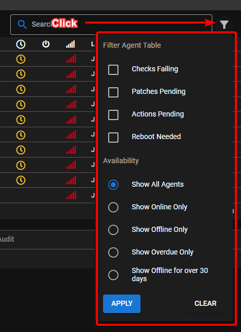
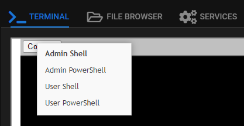
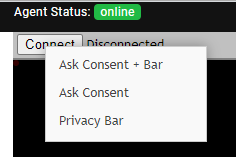
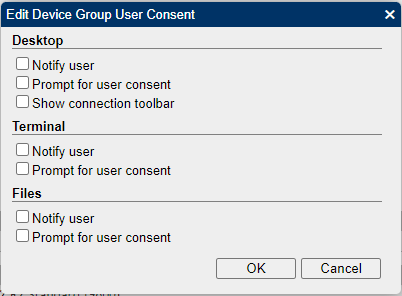
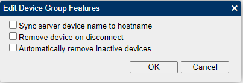
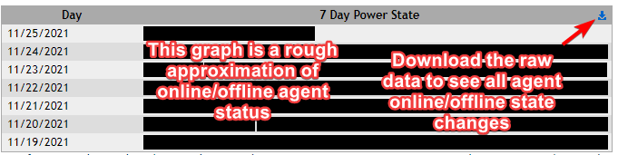
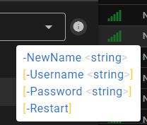

# Tips and Tricks

## Server Monitoring

Monitor Network usage: <https://humdi.net/vnstat/>

Realtime Everything Usage: (_only run when needed because it uses a lot of resources_): <https://learn.netdata.cloud/docs/agent/packaging/installer/methods/kickstart>

## Customize User Interface

At the top right of your web administration interface, click your Username > preferences. Set default tab: Servers|Workstations|Mixed

*****

## Use the filters in the agent list

*****
## MeshCentral

Tactical RMM is actually 2 products: An RMM service with agent, and a secondary [MeshCentral](https://github.com/Ylianst/MeshCentral) install that handles the `Take Control` and `Remote Background` stuff.

Want to download multiple files?

> ZIP zip's the currently selected file(s) and saves it in the current directory. Then you can download the ZIP. It doesn't download and ZIP on the fly.

### Adjust Settings

Right-click the connect button in *Remote Background | Terminal* for shell options

Right-click the connect button in *Take Control* for connect options

### Enable Remote Control options

!!!note
    These settings are independent of Tactical RMM. Enable features (like auto remove inactive devices) with caution

1. Remote background a machine then go to mesh.EXAMPLE.COM
2. Click on My Account
3. Click on the device group you want to enable notifications or accept connection etc on (probably TacticalRMM)
4. Next to User Consent click edit (the wee pencil) 

5. You can also change features by ticking whatever boxes you want in there (Features: Sync server device name to hostname, Automatically remove inactive devices, Notify/Prompt for Consent/Connection Toolbar settings) 

6. Ok your way out

### Agent online/offline logs

In mesh from the agent | General Tab

## Scripts

### When Running Scripts

Use the (i) at the end of the script name to:

- Hover: see script parameter syntax help
- Left Click: Opens the script source in Github

## Running a command on Tactical with Tactical

Use the agent recovery "shell command" feature that will run in detached process so it won't kill itself or create a script that runs detached to call it.
