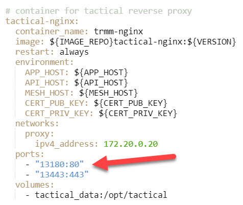
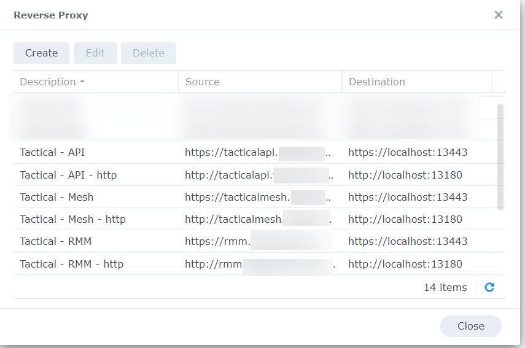
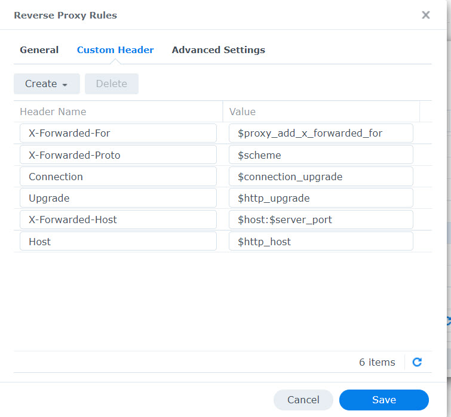
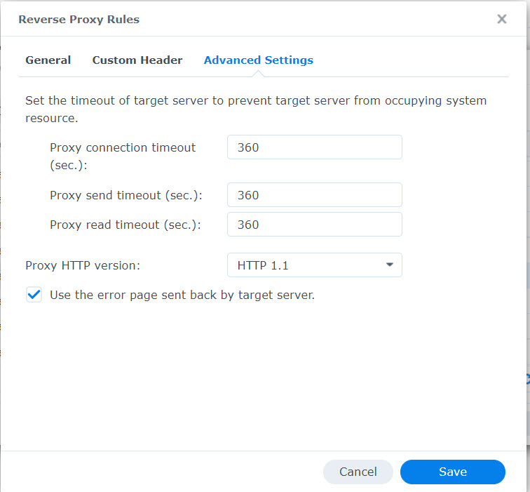

# Installing on Synology NAS using docker install

## Docker Setup

While a docker install is supported, trying to help someone get it working on their own Synology NAS is not. But here's how you do it!

- Follow the [standard docker install](./install_docker.md) documentation.
- Once the `docker-compose` file is downloaded, edit it and modify the ports used by the nginx server to custom ports (`13180` and `13443` in the example below)



## Setup the reverse proxy

Go to **Login Portal > Advanced > Reverse Proxy** in the Control Panel

Create 2 entries for each tactical DNS entries, one for the HTTP port & one for the HTTPS



For the entries related to the mesh, add some custom headers and adjust the proxy timeout connection





## Bonus: SSL Certificate

In regards to the certificate, I followed this [tutorial](https://www.nas-forum.com/forum/topic/68046-tuto-certificat-lets-encrypt-avec-acmesh-api-ovh-en-docker-dsm67-update-180621) (in french but still clear after translation) to automatically update it and manually updating it on the NAS and in TRMM

```bash
docker exec Acme sh -c "acme.sh --issue --keylength 4096 -d '*.mydomain.com' --dns dns_provider"
sed -i '/CERT_PUB_KEY/d' /path/to/tactical/.env
sed -i '/CERT_PRIV_KEY/d' /path/to/tactical/.env
echo "CERT_PUB_KEY=$(sudo base64 -w 0 /volume1/docker/acme/\*.mydomain.com/fullchain.cer)" >> /path/to/tactical/.env
echo "CERT_PRIV_KEY=$(sudo base64 -w 0 /volume1/docker/acme/\*.mydomain.com/*.whitesnew.com.key)" >> /path/to/tactical/.env
docker exec Acme sh -c "acme.sh --deploy -d '*.mydomain.com' --deploy-hook synology_provider"
docker-compose -f /path/to/tactical/docker-compose.yml restart
```
