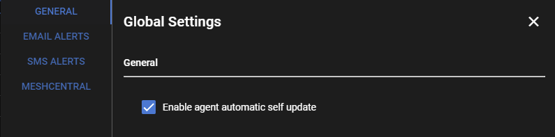

# Updating Agents

!!!warning
    The agent's version is directly tied to the RMM's version.<br/><br/>
    For example, currently RMM version 0.4.17 is compatible with agent version 1.4.6 and lower.<br/><br/>
    You should never attempt to manually update an agent to a newer version without first making sure your RMM is on the latest version.

#### Updating from the Web UI
Agents will automatically self update themselves if you have auto self update enabled in **Settings > Global Settings**<br/><br/>


There is a background job that runs every hour, at 35 minutes past the hour and sends any online agents an update command if it detects they are on an older version.<br/><br/>

You can also trigger this background job to run on demand by clicking **Agents > Update Agents** in the web UI:<br/><br/>


You can individually choose which agents to update, or simply Select All.<br/><br/>
The RMM will automatically skip any agents that don't need updating.<br/><br/>
You can trigger this manual agent update anytime you want. It is safe to spam, and won't run if an agent update task is already running.<br/><br/>
It will also make sure agents update to the correct version, in case they are an older version that cannot be directly upgraded to the latest version.<br/><br/>
For example, agents older than version 1.3.0 must first be updated to 1.3.0 before they can go any further.<br/>

<br/>

#### Manually updating from the command line on the agent

You should never need to do this but might be needed to troubleshoot agents that are not updating automatically.<br/>

Download the `winagent-vX.X.X.exe` executable from the [github releases page](https://github.com/wh1te909/rmmagent/releases) and place it somewhere on the filesystem.<br/>

Open CMD as admin and call the exe like so:

```
C:\Windows\Temp>winagent-vX.X.X.exe /VERYSILENT /LOG=agentupdate.txt
```

This command will return immediately since it spawns a background process to run the update.<br/>
The agent will take around 30 seconds to fully update.<br/><br/>
You can check the `agentupdate.txt` log file that is created for troubleshooting.<br/><br/>
